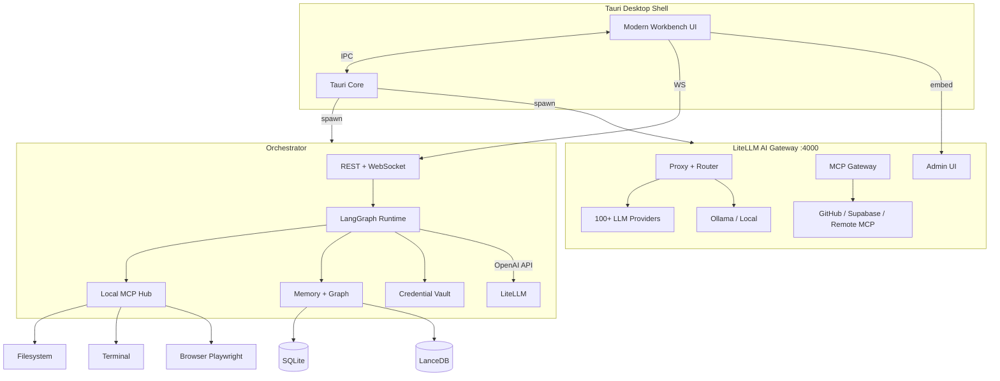

# Atomic-Workstation - Plan

## Goal Capsule

- **Objective:** Ship a self-hostable, desktop-first local AI workstation with a unified modern workbench UI, embedded LiteLLM AI gateway, MCP-connected tool ecosystem, persistent project knowledge graph, and seven end-to-end reference workflows — proving builders can operate entire cross-tool flows without leaving one environment.
- **Authority hierarchy:** This plan's Product Contract defines scope; Key Technical Decisions resolve architecture forks; implementation details not specified here are left to the implementer within stated patterns.
- **Stop conditions:** Stop and surface a blocker if LiteLLM gateway integration cannot satisfy agent + MCP requirements, if OAuth connector flows fail on desktop, or if security review flags credential handling as inadequate for self-host.
- **Execution profile:** Phased delivery across six phases. Prefer characterization tests on orchestration and gateway boundaries; smoke-first for Docker packaging.
- **Tail ownership:** `ce-work` or human implementer owns commits, CI, and PR landing per repo conventions once execution begins.

---

## Product Contract

### Summary

Atomic-Workstation is a local AI workspace where builders run entire workflows — not isolated tasks — across code, terminals, browsers, email, databases, and deployment tools without losing context. v1 delivers a Tauri desktop app with a beautiful dockable workbench, an orchestrator sidecar, an embedded LiteLLM AI gateway (unified LLM routing, budgets, fallbacks, spend tracking, MCP gateway), reusable agent workflows, a local knowledge graph, and connectors for GitHub, Vercel, Gmail, Supabase, and Slack — packaged for self-host via Docker Compose alongside native installers.

### Problem Frame

Modern builders juggle editors, terminals, browsers, dashboards, deployment tools, email, and scattered AI apps. Each tool holds a slice of context; the human becomes the integration layer. AI helps in one tab while the workflow stays fragmented. The bottleneck is operating across disconnected systems, not writing code.

Atomic-Workstation is work orchestration: one visual workstation with system-wide context, persistent project memory, a production-grade LLM gateway, and agents that act across the full builder stack.

### Requirements

**Platform & deployment**

- R1. The product runs as a desktop-first application on macOS, Windows, and Linux with native installers produced from CI.
- R2. The same stack runs self-hosted via Docker Compose (orchestrator, LiteLLM gateway, optional Ollama) for headless or LAN-server deployments.
- R3. Users bring their own API keys for cloud LLM providers; local inference via Ollama-compatible endpoints is supported. No user data is sent for model training.
- R4. All project data, credentials, workflow state, memory stores, and LiteLLM config persist to a user-configurable local data directory.

**LiteLLM AI gateway**

- R5. An embedded LiteLLM proxy exposes an OpenAI-compatible API (`/v1/chat/completions`, `/v1/embeddings`) as the single LLM entry point for all agents and UI features.
- R6. LiteLLM `config.yaml` supports 100+ providers via `model_list`, with router fallbacks, load balancing, cooldowns, and context-window pre-checks.
- R7. Virtual keys with per-key budgets, RPM/TPM rate limits, and budget fallbacks (reroute to cheaper model when budget exceeded).
- R8. Spend tracking and usage logs per virtual key, model, and project tag; surfaced in the workbench and LiteLLM admin UI.
- R9. LiteLLM MCP Gateway registers workstation and external MCP servers (stdio, Streamable HTTP, SSE) with per-key access control.
- R10. LiteLLM admin UI is reachable from the workbench settings panel (embedded webview or deep-link to local `:4000/ui`).

**Modern workbench UI**

- R11. A unified dockable workbench replaces scattered OS windows — editor, terminal, browser, agent, database, email preview, and connector status live in one persistent layout.
- R12. Command palette and keyboard shortcuts for project switch, panel focus, workflow run, and model selection.
- R13. Glassmorphism dark theme with neon cyberpunk accents, visible system status, and neurodivergent-friendly predictable navigation.
- R14. Saved layout presets per project (e.g., "debug", "deploy", "research") restore panel arrangement on switch.

**Workspace & multi-project orchestration**

- R15. Users create workspaces containing multiple projects (git repos or folders), each with isolated terminal sessions, editor state, browser tabs, and agent threads.
- R16. Switching projects restores prior panel layout, open files, terminal cwd, browser URL, and last agent thread in under 2 seconds without data loss.
- R17. A project dashboard shows git status, recent agent runs, connected integrations, memory stats, and LLM spend for that project.

**Work surfaces**

- R18. Code editor panel: syntax highlighting, multi-tab editing, file tree, inline diff view.
- R19. Terminal panel: full PTY sessions scoped to project root, multiple tabs, persistable across switches.
- R20. Browser panel: Playwright-controlled browser for navigation, screenshots, multi-site comparison.
- R21. Database panel: connect Supabase/Postgres/SQLite; run queries; visualize results as tables and charts.
- R22. Email preview panel: render fetched/drafted emails for review before send (approval-gated).

**Agent & reusable workflows**

- R23. Agent runtime executes multi-step workflows with tool calls, streaming status, and human approval gates for destructive actions.
- R24. Users save, name, parameterize, version, and re-run agent workflow templates scoped to workspace or project.
- R25. Workflow library ships built-in templates for all reference use cases; users can fork and customize.
- R26. Destructive actions (deploy, send email, push git, write SQL) require explicit approval before execution.

**Persistent project memory**

- R27. Each project maintains a local knowledge graph: document chunks (RAG), structured facts, and typed relationship edges (repos, services, env vars, deploy targets, team contacts).
- R28. Automatic ingestion of README, manifests, infra configs, git history, connector metadata, and workflow run summaries.
- R29. Hybrid retrieval fuses vector similarity, keyword search, and graph traversal so agents answer infra questions without re-explaining the stack.

**AI-native dev environment**

- R30. Inline agent assistance in the editor: explain, fix, refactor, and generate tests with full project + memory + environment context (not just the open file).
- R31. Debug mode: agent reads terminal output, stack traces, and browser console; proposes fixes with linked diffs.
- R32. All LLM calls route through LiteLLM so model choice, fallbacks, and spend apply consistently across chat, inline assist, and workflows.

**Connected app ecosystem**

- R33. GitHub: repos, PRs, issues, commits, diffs.
- R34. Vercel: deployments, build logs, redeploy (approval-gated).
- R35. Gmail: read inbox, search messages, draft replies (send approval-gated).
- R36. Supabase: project list, SQL queries, table browsing, chart generation from results.
- R37. Slack: read channels, post messages (approval-gated), search history.
- R38. Connector credentials encrypted at rest in vault; OAuth loopback for Gmail and Slack; never logged.

**Reference workflows (v1 acceptance bar)**

- R39. **Bug report email to deployed fix:** Read bug email → find broken code → fix → verify on dev server → deploy → draft reply (send after approval).
- R40. **Analytics query from plain English:** Open database panel → run natural-language query → visualize chart → support follow-up comparison ("vs previous 30 days").
- R41. **Competitive site audit:** Open two sites in browser → screenshot → analyze UX/copy/features → output structured comparison report.
- R42. **Dev standup prep:** Aggregate git, Vercel deploy status, Gmail messages → synthesize paste-ready standup summary.
- R43. **Failed deployment fix:** Read Vercel build logs → fix code → verify in browser → redeploy with approval.
- R44. **Update hero and verify live:** Edit hero component → preview dev server → deploy → confirm production URL.
- R45. **Release changelog to team:** Read git log since last tag → write changelog → draft Slack/Gmail message (send after approval).

### Actors

- A1. **Builder** — primary user.
- A2. **Agent runtime** — LangGraph executor within approval boundaries.
- A3. **MCP servers** — local and remote tool providers.
- A4. **Orchestrator service** — sidecar managing agents, memory, connectors, terminals.
- A5. **LiteLLM gateway** — unified LLM/MCP proxy with budgets, fallbacks, and admin UI.

### Key Flows

- F1. **Project switch** — serialize state → load target → restore panels, terminals, browser, agent thread. Covered by R15, R16.
- F2. **Workflow execution** — load template → inject memory → plan → MCP tools → approval gates → persist log. Covered by R23–R26.
- F3. **Memory ingestion** — scan artifacts → chunk/embed → extract graph → update dashboard. Covered by R27–R29.
- F4. **LLM request via gateway** — agent tags request with project → LiteLLM routes model → fallback on error/budget → log spend. Covered by R5–R8, R32.

### Acceptance Examples

- AE1. **Bug report email to deployed fix** — Given a Gmail bug report and linked repo with reproducible error; agent reads email, fixes code, verifies in browser, deploys after approval, drafts reply.
- AE2. **Analytics query from plain English** — Given Supabase-connected project; user asks "signups last 7 days"; agent queries, renders chart, answers follow-up "compare to previous 30 days."
- AE3. **Competitive site audit** — Given two URLs; agent screenshots both, outputs structured UX/copy/feature comparison markdown.
- AE4. **Dev standup prep** — Given project with recent git activity; agent outputs standup with commits, PRs, deploy status, and relevant emails.
- AE5. **Failed deployment fix** — Given failing Vercel deploy; agent surfaces error, patches code, verifies, redeploys after approval.
- AE6. **Hero update and verify** — Given web project; agent edits hero, previews dev server, deploys, confirms live URL.
- AE7. **Release changelog** — Given tagged releases; agent writes changelog and drafts team message for approval.

### Success Criteria

- New user installs, connects GitHub + Vercel + Gmail + Supabase, and completes AE1–AE4 without leaving the app.
- LiteLLM gateway routes requests with fallback when primary model fails; spend visible per project.
- Cold start to first agent response under 15 seconds on 16GB RAM (excluding model download).
- Docker Compose stack (orchestrator + litellm + optional ollama) passes health checks and API contract tests.
- Zero credentials in logs, exports, or crash reports.

### Scope Boundaries

**In scope (v1)**

- Full LiteLLM gateway feature set (proxy, virtual keys, budgets, fallbacks, spend tracking, MCP gateway, admin UI).
- Modern workbench UI, multi-project orchestration, reusable workflows, knowledge graph memory, AI-native dev assist.
- Connectors: GitHub, Vercel, Gmail, Supabase, Slack.
- Seven reference workflows (AE1–AE7).
- Docker self-host + native desktop installers.

**Deferred for later**

- Weekly metrics HTML email digest (extends AE2 pattern; not blocking v1).
- Team multi-user RBAC and org-wide connector permission sync.
- Native mobile clients.
- LiteLLM Enterprise-only features (SSO, advanced audit) — open-source gateway scope only.

**Outside this product's identity**

- Hosted multi-tenant SaaS with vendor-managed keys.
- Training or fine-tuning on user data.
- Full IDE replacement (VS Code/JetBrains parity).

### Outstanding Questions

- Q1. Gmail OAuth: Google Cloud project setup documented for self-hosters; desktop uses loopback redirect.
- Q2. LiteLLM DB: PostgreSQL for production self-host vs SQLite for single-user desktop — default SQLite for desktop, Postgres optional in Compose.

---

## Planning Contract

### Assumptions

- Single-user local deployment for desktop; Docker Compose supports optional Postgres for LiteLLM DB.
- Reference workflows use bundled sample project + mock connectors in CI.
- LiteLLM open-source proxy (MIT) is sufficient; no Enterprise license required for v1.

### Key Technical Decisions

- **KTD1. Tauri 2 + React for desktop shell** — Low idle RAM vs Electron; Rust handles keychain and sidecar lifecycle.

- **KTD2. TypeScript orchestrator sidecar** — Node 20 service for agents, MCP, memory, connectors; communicates over localhost WebSocket + REST.

- **KTD3. Dual MCP architecture** — Local `mcp-hub` manages workstation-native tools (filesystem, PTY, browser, git). LiteLLM MCP Gateway manages external/OAuth MCP servers (GitHub remote, Supabase) with per-key ACL. Agent runtime merges tool catalogs from both sources.

- **KTD4. LiteLLM as the sole LLM gateway** — All agent, inline-assist, and embedding calls go to `http://localhost:4000/v1`. Replaces per-provider SDK wiring in orchestrator. Provider API keys live in LiteLLM config (fed from vault at startup). Chosen for unified routing, budgets, fallbacks, spend tracking, and 100+ provider support without custom adapter code.

- **KTD5. LangGraph for workflow execution** — State machines, human-in-the-loop interrupts, durable checkpoints. Workflows are serialized graph definitions in `packages/workflows`.

- **KTD6. Hybrid memory: SQLite + LanceDB + property graph** — Entities/edges in SQLite; vectors in LanceDB; recursive CTE traversal. Upgrade path to Graphiti documented.

- **KTD7. Playwright MCP for browser panel** — Multi-tab, screenshots, competitive audit support.

- **KTD8. Docker Compose stack** — Services: `orchestrator`, `litellm`, `postgres` (optional), `ollama` (optional). Shared data volume.

- **KTD9. Gmail/Slack via OAuth loopback** — Orchestrator hosts `localhost:PORT/oauth/callback`; tokens stored in vault; MCP wrappers expose read/draft/post tools.

### High-Level Technical Design



### Output Structure

```text
atomic-workstation/
├── apps/
│   ├── desktop/
│   └── orchestrator/
├── packages/
│   ├── shared/
│   ├── ui/                      # Workbench design system
│   ├── mcp-hub/                 # Local workstation MCP
│   ├── memory/
│   └── workflows/
├── deploy/
│   ├── docker-compose.yml
│   ├── litellm/
│   │   ├── config.yaml          # model_list, fallbacks, router_settings
│   │   └── Dockerfile
│   └── Dockerfile.orchestrator
├── examples/
│   └── sample-next-app/
└── docs/
```

### Phased Delivery

| Phase | Units | Outcome |
| --- | --- | --- |
| **P0 Foundation** | U1–U3 | Monorepo, orchestrator, projects |
| **P1 Workbench** | U4, U14 | Editor, terminal, modern shell UI |
| **P2 Gateway** | U13 | LiteLLM embedded + admin access |
| **P3 Agent core** | U5, U6, U7 | MCP hubs, agent runtime, workflows |
| **P4 Surfaces** | U8, U16, U21 | Browser, AI-native dev, DB/email panels |
| **P5 Ecosystem** | U9, U10 | Memory graph, full connectors |
| **P6 Ship** | U11, U12 | Docker, all reference workflows |

### Risks & Dependencies

| Risk | Mitigation |
| --- | --- |
| LiteLLM + local MCP tool merge complexity | Unified tool registry in orchestrator; integration tests for dual-source `tools/list` |
| LiteLLM memory footprint alongside Tauri + Ollama | LiteLLM in separate container; desktop spawns only when needed |
| Gmail/Slack OAuth on desktop | Loopback server; document Google Cloud console steps |
| Competitive audit LLM cost | Route audit workflows to budget-capped virtual key via LiteLLM |
| Graph memory quality | Hybrid retrieval; Graphiti upgrade path |

### Sources & Research

- LiteLLM: OpenAI-compatible proxy, virtual keys, budget fallbacks, MCP gateway (stdio/HTTP/SSE), admin UI — docs.litellm.ai.
- MCP architecture: local hub for workstation tools; LiteLLM MCP gateway for external servers with per-key ACL.
- Tauri 2 sidecar pattern for low-RAM desktop AI tooling.

---

## Implementation Units

| U-ID | Title | Primary paths | Depends on |
| --- | --- | --- | --- |
| U1 | Monorepo and Tauri shell scaffold | `package.json`, `apps/desktop/` | — |
| U2 | Orchestrator sidecar and API | `apps/orchestrator/`, `packages/shared/` | U1 |
| U3 | Workspace and project management | `apps/orchestrator/src/projects/`, `apps/desktop/src/features/projects/` | U2 |
| U4 | Editor and terminal panels | `apps/desktop/src/panels/`, `packages/ui/` | U3 |
| U5 | Local MCP hub and credential vault | `packages/mcp-hub/`, `apps/orchestrator/src/vault/` | U2 |
| U6 | Agent runtime via LiteLLM | `apps/orchestrator/src/agent/`, `packages/workflows/` | U5, U13 |
| U7 | Workflow templates and run UI | `packages/workflows/`, `apps/desktop/src/features/workflows/` | U6 |
| U8 | Browser panel and Playwright MCP | `apps/desktop/src/panels/browser/` | U5 |
| U9 | Project memory and knowledge graph | `packages/memory/` | U3 |
| U10 | Full connector ecosystem | `packages/mcp-hub/servers/`, connector routes | U5, U9, U13 |
| U11 | Docker self-host distribution | `deploy/` | U2, U13 |
| U12 | Reference workflows AE1–AE7 | `examples/`, workflow templates | U7, U8, U10 |
| U13 | LiteLLM AI gateway integration | `deploy/litellm/`, `apps/orchestrator/src/gateway/` | U2 |
| U14 | Modern workbench shell UI | `apps/desktop/src/workbench/`, `packages/ui/` | U3 |
| U16 | AI-native dev and debug assist | `apps/desktop/src/panels/editor/`, agent inline tools | U4, U6, U9 |
| U21 | Database and email panels | `apps/desktop/src/panels/database/`, `email/` | U10 |

### U13. LiteLLM AI gateway integration

- **Goal:** Embedded LiteLLM proxy is the single LLM/MCP gateway for all workstation AI features.
- **Requirements:** R5–R10, R32, KTD4
- **Dependencies:** U2
- **Files:** `deploy/litellm/config.yaml`, `deploy/litellm/Dockerfile`, `apps/orchestrator/src/gateway/litellm-client.ts`, `apps/orchestrator/src/gateway/virtual-keys.ts`, `apps/desktop/src/features/settings/GatewaySettings.tsx`, `apps/desktop/src-tauri/src/sidecar.rs`
- **Approach:** Tauri/Docker spawn LiteLLM on port 4000. `config.yaml` defines `model_list` (OpenAI, Anthropic, Ollama), `router_settings` (fallbacks, cooldowns, `enable_pre_call_checks`), and `general_settings` (master key, store in DB). Orchestrator creates per-project virtual keys via LiteLLM API with budget tags. Vault syncs provider keys into LiteLLM env at startup. Register external MCP servers in LiteLLM UI/API. Workbench settings embed admin UI or link to `:4000/ui`. Agent runtime uses `baseURL: http://localhost:4000/v1`.
- **Test scenarios:**
  - Chat completion succeeds through LiteLLM for configured OpenAI and Ollama models.
  - Fallback chain routes to secondary model when primary returns 429.
  - Virtual key budget exceeded triggers budget_fallback model.
  - Spend log records cost tagged with project ID.
  - MCP tool registered in LiteLLM is callable via gateway REST API.
  - Admin UI loads from workbench settings.
- **Verification:** Integration tests against LiteLLM test container; fallback test with mock failing provider.

### U14. Modern workbench shell UI

- **Goal:** Beautiful, unified dockable environment replacing scattered tabs and windows.
- **Requirements:** R11–R14
- **Dependencies:** U3
- **Files:** `apps/desktop/src/workbench/WorkbenchLayout.tsx`, `apps/desktop/src/workbench/CommandPalette.tsx`, `apps/desktop/src/workbench/StatusBar.tsx`, `apps/desktop/src/workbench/LayoutPresets.tsx`, `packages/ui/src/tokens.css`, `packages/ui/src/PanelChrome.tsx`
- **Approach:** `react-resizable-panels` dock with persistent layout JSON per project. Command palette (Cmd+K) for project switch, panel focus, workflow run, model picker. NeuroRainbow Cyberpunk tokens: `#05070D` bg, neon cyan/magenta accents, glassmorphism panels, Orbitron/Space Grotesk fonts. Status bar shows active project, agent run state, LiteLLM model, and connection health. Layout presets: Debug, Deploy, Research.
- **Test scenarios:**
  - Dock panels resize and persist across app restart.
  - Command palette switches project and focuses correct panel.
  - Layout preset restores panel arrangement.
  - Status bar reflects agent running vs idle.
- **Verification:** Playwright visual smoke; layout persistence unit test.

### U6. Agent runtime via LiteLLM (updated)

- **Goal:** LangGraph agent executes tool loops; all LLM calls route through LiteLLM gateway.
- **Requirements:** R23, R26, R32, KTD4, KTD5
- **Dependencies:** U5, U13
- **Files:** `apps/orchestrator/src/agent/runtime.ts`, `apps/orchestrator/src/agent/tool-registry.ts`, `apps/orchestrator/src/agent/approval-gate.ts`, `apps/orchestrator/src/routes/agent.ts`
- **Approach:** Merge tools from local MCP hub and LiteLLM MCP gateway into unified registry. LangGraph graph with approval interrupts. LLM client points to LiteLLM with project-scoped virtual key header. Streaming events over WebSocket. No direct OpenAI/Anthropic SDK calls in orchestrator.
- **Test scenarios:**
  - Agent uses local filesystem tool and LiteLLM-hosted remote tool in same run.
  - Destructive tool pauses for approval.
  - LiteLLM fallback model used when primary fails mid-run.
- **Verification:** Integration test with mock LiteLLM and real local MCP.

### U10. Full connector ecosystem (expanded)

- **Goal:** MCP-backed connectors for GitHub, Vercel, Gmail, Supabase, and Slack.
- **Requirements:** R33–R38, KTD9
- **Dependencies:** U5, U9, U13
- **Files:** `packages/mcp-hub/servers/github.ts`, `vercel.ts`, `gmail.ts`, `supabase.ts`, `slack.ts`, `apps/orchestrator/src/connectors/`, `apps/orchestrator/src/oauth/`, `apps/desktop/src/features/settings/ConnectorSettings.tsx`
- **Approach:** GitHub/Vercel via MCP (local or LiteLLM-registered). Gmail/Slack: OAuth loopback in orchestrator, tokens in vault, custom MCP servers exposing read/draft/send (send approval-gated). Supabase: MCP server for SQL + management API; register in LiteLLM for remote access. All credentials from vault; OAuth scopes documented.
- **Test scenarios:**
  - GitHub returns open PRs; Vercel returns build log.
  - Gmail OAuth completes; read inbox returns messages (mocked in CI).
  - Supabase natural-language query returns tabular data.
  - Slack draft message requires approval before post.
  - Send email tool blocked until user approves.
- **Verification:** Contract tests with HTTP fixtures; OAuth flow manual test doc.

### U16. AI-native dev and debug assist

- **Goal:** Editor-integrated LLM assistance with full project, memory, and environment context.
- **Requirements:** R30, R31, R32
- **Dependencies:** U4, U6, U9
- **Files:** `apps/desktop/src/panels/editor/InlineAssist.tsx`, `apps/desktop/src/panels/editor/DebugAssist.tsx`, `apps/orchestrator/src/agent/context-builder.ts`
- **Approach:** Context builder assembles: open file, related files from memory graph, terminal last N lines, browser console if attached, git diff, project manifest. Inline assist actions: explain, fix, refactor, test. Debug mode triggered from terminal error pattern or explicit command. All calls via LiteLLM with same virtual key as chat.
- **Test scenarios:**
  - Inline "explain" includes README deploy info from memory graph.
  - Debug assist proposes fix given terminal stack trace fixture.
  - Model and spend match project tag in LiteLLM logs.
- **Verification:** Context builder unit tests; inline assist integration with mock LLM.

### U21. Database and email panels

- **Goal:** Visual panels for Supabase/SQL queries and email preview/draft review.
- **Requirements:** R21, R22
- **Dependencies:** U10
- **Files:** `apps/desktop/src/panels/database/DatabasePanel.tsx`, `apps/desktop/src/panels/database/ChartView.tsx`, `apps/desktop/src/panels/email/EmailPanel.tsx`
- **Approach:** Database panel: connection picker, SQL editor, results table, chart toggle (bar/line for numeric columns). Email panel: renders HTML/text preview of fetched or drafted messages; approve/reject send actions wire to approval gate.
- **Test scenarios:**
  - Query results render table; chart appears for numeric aggregate.
  - Email preview shows drafted reply before approval.
- **Verification:** Component tests with fixture data.

### U12. Reference workflows AE1–AE7 (expanded)

- **Goal:** Seven built-in workflow templates covering all product use cases.
- **Requirements:** R39–R45, AE1–AE7
- **Dependencies:** U7, U8, U10, U21
- **Files:** `packages/workflows/src/templates/bug-email-to-fix.ts`, `analytics-query.ts`, `competitive-audit.ts`, `standup-prep.ts`, `fix-deployment.ts`, `update-hero.ts`, `release-changelog.ts`, `examples/sample-next-app/`, `apps/orchestrator/src/seed/demo-workspace.ts`
- **Approach:** Each template is a LangGraph graph with documented tool sequence. Sample app supports deploy-fix and hero scenarios. Mock connectors in CI for Gmail/Supabase/Slack. E2E suite runs AE1–AE4 in CI; AE5–AE7 in extended manual checklist.
- **Test scenarios:**
  - Covers AE1: bug email workflow drafts reply, blocks send until approval.
  - Covers AE2: analytics chart + 30-day comparison follow-up.
  - Covers AE3: competitive audit outputs structured markdown with screenshots.
  - Covers AE4: standup includes git, deploy, email sections.
  - Covers AE5–AE7: per original acceptance criteria.
- **Verification:** E2E workflow test suite; onboarding README walks AE1–AE4.

### U1–U5, U7–U9, U11 (unchanged scope, updated requirement refs)

Units U1–U5, U7–U9, U11 retain prior implementation detail with requirement ID updates to the expanded R1–R45 numbering. U4 additionally depends on U14 for workbench chrome. U11 Compose file adds `litellm` and optional `postgres` services.

---

## Verification Contract

| Gate | Command / check | When |
| --- | --- | --- |
| Unit tests | `pnpm -r test` | Every commit |
| Typecheck | `pnpm -r typecheck` | Every commit |
| LiteLLM integration | `pnpm --filter orchestrator test:litellm` | PR |
| Orchestrator integration | `pnpm --filter orchestrator test:integration` | PR |
| Desktop E2E | `pnpm --filter desktop test:e2e` | PR (AE1–AE4) |
| Docker smoke | `docker compose -f deploy/docker-compose.yml up --wait` | PR |
| Gateway health | `curl localhost:4000/health` after compose up | PR |
| Security | Secret scan + OAuth token never in logs | PR |

---

## Definition of Done

**Global**

- R1–R45 traced to implementation units and tests.
- LiteLLM gateway: routing, fallbacks, virtual keys, spend tracking, MCP gateway, admin UI — all functional.
- AE1–AE4 pass in CI; AE5–AE7 pass manually with real connectors.
- Modern workbench UI meets R11–R14 (dockable, command palette, theme, layout presets).
- Docker Compose includes orchestrator + litellm; desktop installers build on CI.
- No P0/P1 security findings.

**Per-unit highlights**

| Unit | Done when |
| --- | --- |
| U13 | LiteLLM routes LLM + MCP; fallbacks and budgets work |
| U14 | Workbench dock, palette, presets, status bar live |
| U10 | GitHub, Vercel, Gmail, Supabase, Slack connectors pass tests |
| U16 | Inline assist + debug mode use full context via LiteLLM |
| U21 | DB charts + email preview panels work |
| U12 | AE1–AE7 templates run end-to-end |

---

## Appendix

### LiteLLM config sketch (directional)

```yaml
model_list:
  - model_name: gpt-4o
    litellm_params:
      model: openai/gpt-4o
      api_key: os.environ/OPENAI_API_KEY
  - model_name: claude-sonnet
    litellm_params:
      model: anthropic/claude-sonnet-4-20250514
      api_key: os.environ/ANTHROPIC_API_KEY
  - model_name: local-llama
    litellm_params:
      model: ollama/llama3.1
      api_base: http://ollama:11434

router_settings:
  enable_pre_call_checks: true
  num_retries: 2
  fallbacks:
    - gpt-4o: [claude-sonnet, local-llama]

general_settings:
  master_key: os.environ/LITELLM_MASTER_KEY
  store_model_in_db: true
```

### UI design notes

NeuroRainbow Cyberpunk: `#05070D` background, `#00E5FF` cyan / `#FF00AA` magenta accents, glassmorphism, predictable nav, visible agent/gateway status, chunked workflow timeline.
