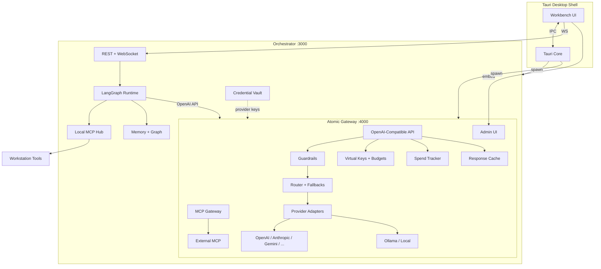
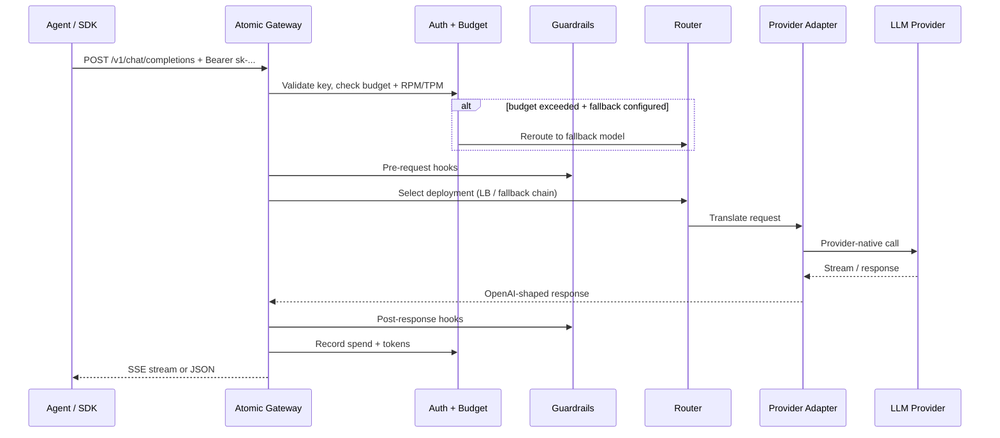

# Atomic-Workstation - Plan

## Goal Capsule

- **Objective:** Ship a self-hostable, desktop-first local AI workstation with a unified modern workbench UI, a **first-party Atomic Gateway** (custom-built LLM/MCP gateway with LiteLLM-class capabilities), MCP-connected tool ecosystem, persistent project knowledge graph, and seven end-to-end reference workflows.
- **Authority hierarchy:** This plan's Product Contract defines scope; Key Technical Decisions resolve architecture forks; implementation details not specified here are left to the implementer within stated patterns.
- **Stop conditions:** Stop and surface a blocker if the gateway adapter framework cannot support required providers, if OAuth connector flows fail on desktop, or if security review flags credential handling as inadequate for self-host.
- **Execution profile:** Phased delivery across seven phases. Gateway is a first-class subsystem — not a third-party dependency. Prefer contract tests on OpenAI-compatible API surface and provider adapters.
- **Tail ownership:** `ce-work` or human implementer owns commits, CI, and PR landing per repo conventions once execution begins.

---

## Product Contract

### Summary

Atomic-Workstation is a local AI workspace where builders run entire workflows across code, terminals, browsers, email, databases, and deployment tools without losing context. v1 delivers a Tauri desktop app, an orchestrator sidecar, **Atomic Gateway** (our own OpenAI-compatible AI gateway with routing, virtual keys, budgets, fallbacks, spend tracking, MCP gateway, caching, guardrails, and admin UI), reusable agent workflows, a local knowledge graph, and connectors for GitHub, Vercel, Gmail, Supabase, and Slack.

**Product Contract preservation:** Changed R5–R10, R32, KTD3, KTD4, actor A5, and gateway units — user-directed decision to build a first-party gateway instead of embedding LiteLLM.

### Problem Frame

Modern builders juggle editors, terminals, browsers, dashboards, deployment tools, email, and scattered AI apps. Each tool holds a slice of context; the human becomes the integration layer. AI helps in one tab while the workflow stays fragmented. The bottleneck is operating across disconnected systems, not writing code.

Atomic-Workstation is work orchestration: one visual workstation with system-wide context, persistent project memory, a **native AI gateway we own end-to-end**, and agents that act across the full builder stack.

### Requirements

**Platform & deployment**

- R1. The product runs as a desktop-first application on macOS, Windows, and Linux with native installers produced from CI.
- R2. The same stack runs self-hosted via Docker Compose (orchestrator, Atomic Gateway, optional Ollama) for headless or LAN-server deployments.
- R3. Users bring their own API keys for cloud LLM providers; local inference via Ollama-compatible endpoints is supported. No user data is sent for model training.
- R4. All project data, credentials, workflow state, memory stores, and gateway config persist to a user-configurable local data directory.

**Atomic Gateway — core proxy API**

- R5. Atomic Gateway exposes an OpenAI-compatible REST API as the single LLM entry point: `/v1/chat/completions`, `/v1/embeddings`, `/v1/completions`, `/v1/models`, streaming via SSE.
- R6. Drop-in replacement: any OpenAI SDK client works by pointing `baseURL` at the gateway; request/response shapes match OpenAI spec.
- R7. Gateway config via `gateway.yaml` (model deployments, router rules, fallbacks, cache, guardrails) plus CRUD API for runtime changes.
- R8. Master key authentication for admin/management endpoints; Bearer virtual-key auth for inference endpoints.
- R9. Health, readiness, and provider status endpoints for orchestrator and Docker healthchecks.
- R10. Pass-through mode: optional raw proxy to a provider's native API for migration of existing integrations.

**Atomic Gateway — provider routing**

- R11. Pluggable provider adapter framework: each adapter implements a shared `ProviderAdapter` interface (chat, embed, stream, token count, cost estimate).
- R12. v1 ships tier-1 adapters: OpenAI, Anthropic, Google Gemini, Azure OpenAI, AWS Bedrock, Ollama, Mistral, Groq, Together, DeepSeek, OpenRouter.
- R13. Model registry maps logical `model_name` aliases to one or more provider deployments (e.g., `gpt-4o` → OpenAI deployment A or B).
- R14. Router supports retries, automatic fallbacks on provider errors, cooldown after repeated failures, and usage-based load balancing across deployments.
- R15. Pre-call context-window check rejects or reroutes requests that exceed model limits before hitting the provider.
- R16. Adapter plugin SDK and docs so additional providers can be added without modifying gateway core (path to 100+ providers over time).

**Atomic Gateway — keys, budgets, rate limits**

- R17. Virtual keys: generate scoped API keys with model allowlists, budget caps, rate limits, and metadata tags (project ID, workspace).
- R18. Per-key budgets: daily/monthly spend caps in USD; hard block or budget-fallback to cheaper model when exceeded.
- R19. Rate limits: configurable RPM and TPM per virtual key, team, or model.
- R20. Team and organization primitives (single-user desktop defaults to one team; multi-tenant hooks for self-host).

**Atomic Gateway — spend tracking & observability**

- R21. Log every request: model, provider, tokens in/out, latency, cost estimate, virtual key, project tag, status.
- R22. Spend aggregation API and admin UI: by key, model, provider, project tag, time range.
- R23. Export hooks: OpenTelemetry traces, webhook callbacks, and optional Langfuse/LangSmith-compatible log sink.
- R24. Prometheus `/metrics` endpoint for self-host monitoring.

**Atomic Gateway — MCP gateway**

- R25. MCP Gateway registers servers (stdio, Streamable HTTP, SSE) and exposes a unified tool catalog to agents.
- R26. Per-virtual-key MCP access control: which servers and tools each key may invoke.
- R27. MCP REST endpoints: `/mcp/tools/list`, `/mcp/tools/call` for direct tool invocation without LLM round-trip.
- R28. OAuth helper for MCP servers that require it (PKCE loopback, token storage in vault).

**Atomic Gateway — caching, guardrails, policies**

- R29. Response cache: optional exact-match and semantic-similarity cache with TTL; SQLite default, Redis optional in Compose.
- R30. Guardrails pipeline: request/response hooks for content policy, PII redaction, and custom plugin middleware.
- R31. Default-on guardrails configurable per key, team, or model.

**Atomic Gateway — admin UI**

- R32. Built-in admin dashboard (React, served by gateway on `:4000/admin`): keys, models, deployments, spend charts, request logs, MCP servers, guardrails.
- R33. Admin UI reachable from workbench settings (embedded webview or deep-link).

**Modern workbench UI**

- R34. Unified dockable workbench: editor, terminal, browser, agent, database, email preview, connector status, gateway status in one layout.
- R35. Command palette and keyboard shortcuts for project switch, panel focus, workflow run, model selection.
- R36. Glassmorphism dark theme with neon cyberpunk accents and neurodivergent-friendly predictable navigation.
- R37. Saved layout presets per project restore panel arrangement on switch.

**Workspace & multi-project orchestration**

- R38. Workspaces contain multiple projects with isolated terminal, editor, browser, and agent state.
- R39. Project switch restores layout, files, terminal cwd, browser URL, and agent thread in under 2 seconds.
- R40. Project dashboard shows git status, agent runs, connectors, memory stats, and gateway spend for that project.

**Work surfaces**

- R41. Code editor: syntax highlighting, multi-tab, file tree, inline diff.
- R42. Terminal: full PTY, multiple tabs, persistable across switches.
- R43. Browser: Playwright-controlled, screenshots, multi-site comparison.
- R44. Database panel: Supabase/Postgres/SQLite queries with table and chart views.
- R45. Email preview panel: render fetched/drafted emails; send approval-gated.

**Agent & reusable workflows**

- R46. Agent runtime: multi-step workflows, tool calls, streaming, approval gates for destructive actions.
- R47. Save, version, parameterize, and re-run workflow templates.
- R48. Built-in templates for all seven reference use cases.
- R49. Destructive actions require explicit approval.

**Persistent project memory**

- R50. Local knowledge graph: RAG chunks, structured facts, typed relationship edges.
- R51. Auto-ingest README, manifests, infra configs, git history, connector metadata, workflow logs.
- R52. Hybrid retrieval: vector + keyword + graph traversal.

**AI-native dev environment**

- R53. Inline editor assist (explain, fix, refactor, test) with full project + memory + environment context.
- R54. Debug mode reads terminal output, stack traces, browser console; proposes linked diffs.
- R55. All LLM calls route through Atomic Gateway for consistent model choice, fallbacks, and spend.

**Connected app ecosystem**

- R56. GitHub: repos, PRs, issues, commits, diffs.
- R57. Vercel: deployments, build logs, redeploy (approval-gated).
- R58. Gmail: read, search, draft replies (send approval-gated).
- R59. Supabase: projects, SQL, table browse, chart from results.
- R60. Slack: read channels, post (approval-gated), search.
- R61. Connector credentials encrypted in vault; OAuth loopback for Gmail/Slack.

**Reference workflows (v1 acceptance bar)**

- R62. Bug report email to deployed fix.
- R63. Analytics query from plain English with chart and follow-up comparison.
- R64. Competitive site audit with screenshots and structured report.
- R65. Dev standup prep.
- R66. Failed deployment fix.
- R67. Update hero and verify live.
- R68. Release changelog to team.

### Actors

- A1. **Builder** — primary user.
- A2. **Agent runtime** — LangGraph executor within approval boundaries.
- A3. **MCP servers** — local and remote tool providers.
- A4. **Orchestrator service** — sidecar managing agents, memory, connectors, terminals.
- A5. **Atomic Gateway** — first-party LLM/MCP proxy with routing, keys, budgets, and admin UI.

### Key Flows

- F1. **Project switch** — Covered by R38, R39.
- F2. **Workflow execution** — Covered by R46–R49.
- F3. **Memory ingestion** — Covered by R50–R52.
- F4. **LLM request via Atomic Gateway** — virtual key auth → budget/rate check → guardrails → router → provider adapter → spend log → cache write. Covered by R5–R24, R55.

### Acceptance Examples

- AE1. Bug report email to deployed fix.
- AE2. Analytics query from plain English with 30-day follow-up.
- AE3. Competitive site audit with structured comparison.
- AE4. Dev standup prep.
- AE5. Failed deployment fix.
- AE6. Hero update and verify live.
- AE7. Release changelog to team.

- AE8. **Gateway fallback** — Given `gpt-4o` primary and `claude-sonnet` fallback; when OpenAI returns 429, gateway automatically completes via Anthropic without client retry.
- AE9. **Budget fallback** — Given virtual key with $5/day cap on `gpt-4o` and fallback to `gpt-4o-mini`; when cap hit, next request routes to mini model and spend attributes correctly.

### Success Criteria

- AE1–AE4 and AE8–AE9 pass in CI.
- OpenAI Python/JS SDK works against gateway with only `baseURL` change.
- Tier-1 provider adapters pass contract test suite.
- Gateway admin UI manages keys, models, and spend without editing YAML by hand.
- Docker Compose (orchestrator + gateway + optional ollama) healthy.
- Zero credentials in logs or exports.

### Scope Boundaries

**In scope (v1)**

- Full first-party Atomic Gateway (all R5–R33).
- Tier-1 provider adapters (R12); adapter SDK for extension (R16).
- Modern workbench, multi-project orchestration, workflows, memory, AI-native dev, full connector set.
- Seven reference workflows (AE1–AE7).
- Docker self-host + native installers.

**Deferred for later**

- Tier-2/3 provider adapters beyond tier-1 (community plugin marketplace).
- A/B traffic mirroring and silent shadow deployments.
- Enterprise SSO (OIDC/SAML) for gateway admin — JWT auth hooks only in v1.
- Weekly metrics HTML email digest.
- Team multi-user RBAC beyond gateway primitives.
- Native mobile clients.

**Outside this product's identity**

- Embedding or depending on LiteLLM or any third-party AI gateway product.
- Hosted multi-tenant SaaS with vendor-managed keys.
- Training or fine-tuning on user data.
- Full IDE replacement.

### Outstanding Questions

- Q1. Gmail OAuth: document Google Cloud setup; desktop uses loopback redirect.
- Q2. Gateway persistence: SQLite for desktop single-user; Postgres optional in Compose for self-host.

---

## Planning Contract

### Assumptions

- Single-user desktop defaults to one team/org in gateway; multi-tenant schema ready for self-host expansion.
- Tier-1 adapters cover builder use cases; remaining providers ship as plugins post-v1.
- Reference workflows use sample project + mock connectors in CI.

### Key Technical Decisions

- **KTD1. Tauri 2 + React for desktop shell** — Low idle RAM; Rust handles keychain and sidecar lifecycle.

- **KTD2. TypeScript orchestrator sidecar** — Node 20 for agents, memory, connectors.

- **KTD3. Atomic Gateway as a separate first-party service** (session-settled: user-directed — chosen over embedding LiteLLM: own the full gateway stack, no third-party proxy dependency, native integration with workstation vault and UI). `apps/gateway` runs on `:4000`; orchestrator and agents call `http://localhost:4000/v1`. Gateway is TypeScript (Fastify) with hot-path provider calls; consider Rust rewrite for adapter hot path only if profiling demands it.

- **KTD4. Provider adapter plugin architecture** — `packages/gateway-core` defines interfaces; `packages/gateway-providers/*` implements per-vendor translation (OpenAI-shaped gateway API ↔ provider-native API). New providers = new package, registered in config. Mirrors LiteLLM's provider abstraction but is wholly owned code.

- **KTD5. Dual MCP architecture** — Local `mcp-hub` in orchestrator for workstation tools (filesystem, PTY, browser). Atomic Gateway MCP Gateway for external/OAuth MCP servers with per-key ACL. Agent runtime merges tool catalogs.

- **KTD6. LangGraph for workflow execution** — State machines, approval interrupts, checkpoints.

- **KTD7. Hybrid memory: SQLite + LanceDB + property graph** — Same as prior plan.

- **KTD8. Docker Compose** — Services: `orchestrator`, `gateway`, `postgres` (optional), `ollama` (optional), `redis` (optional, cache).

- **KTD9. Gmail/Slack OAuth loopback** — Orchestrator hosts callback; gateway MCP layer can also proxy OAuth MCP servers.

### High-Level Technical Design



**Gateway request pipeline**



### Output Structure

```text
atomic-workstation/
├── apps/
│   ├── desktop/
│   ├── orchestrator/
│   └── gateway/                    # Atomic Gateway service
│       ├── src/
│       │   ├── server.ts
│       │   ├── routes/             # /v1/*, /admin/api/*
│       │   ├── router/
│       │   ├── auth/
│       │   ├── spend/
│       │   ├── mcp/
│       │   ├── cache/
│       │   ├── guardrails/
│       │   └── admin-ui/         # React admin dashboard
│       └── gateway.yaml
├── packages/
│   ├── gateway-core/               # Interfaces, types, config schema
│   ├── gateway-providers/
│   │   ├── openai/
│   │   ├── anthropic/
│   │   ├── google/
│   │   ├── ollama/
│   │   ├── azure-openai/
│   │   ├── bedrock/
│   │   └── ...                     # One package per tier-1 provider
│   ├── shared/
│   ├── ui/
│   ├── mcp-hub/
│   ├── memory/
│   └── workflows/
├── deploy/
│   ├── docker-compose.yml
│   ├── gateway.yaml
│   └── Dockerfile.gateway
└── examples/
```

### Phased Delivery

| Phase | Units | Outcome |
| --- | --- | --- |
| **P0 Foundation** | U1–U3 | Monorepo, orchestrator, projects |
| **P1 Gateway core** | U13, U15, U17 | Proxy API, adapters, router |
| **P2 Gateway ops** | U18, U19, U20, U22 | Keys/budgets, MCP gateway, admin UI, cache/guardrails |
| **P3 Workbench** | U4, U14 | Editor, terminal, modern shell |
| **P4 Agent core** | U5, U6, U7 | MCP hub, agent runtime, workflows |
| **P5 Surfaces + ecosystem** | U8, U9, U10, U16, U21 | Browser, memory, connectors, dev assist, DB/email |
| **P6 Ship** | U11, U12 | Docker, reference workflows |

### Risks & Dependencies

| Risk | Mitigation |
| --- | --- |
| Building gateway is large scope | Phased units; OpenAI-compat contract tests gate each phase |
| Provider API drift | Adapter version pinning; contract tests per provider with recorded fixtures |
| 100+ provider parity takes years | Tier-1 v1 + plugin SDK; document extension path |
| Gateway + orchestrator + Ollama RAM | Separate processes; lazy Ollama start |
| MCP tool merge complexity | Unified tool registry in orchestrator |

### Alternatives Considered

| Alternative | Why not |
| --- | --- |
| Embed LiteLLM | User-directed: build own gateway, full control, no upstream dependency |
| Direct per-provider SDKs in orchestrator | No unified budgets, fallbacks, or spend tracking |
| Rust gateway from day one | Slower iteration; TypeScript first, profile before rewrite |

---

## Implementation Units

| U-ID | Title | Primary paths | Depends on |
| --- | --- | --- | --- |
| U1 | Monorepo and Tauri shell scaffold | `package.json`, `apps/desktop/` | — |
| U2 | Orchestrator sidecar and API | `apps/orchestrator/`, `packages/shared/` | U1 |
| U3 | Workspace and project management | `apps/orchestrator/src/projects/` | U2 |
| U4 | Editor and terminal panels | `apps/desktop/src/panels/` | U3, U14 |
| U5 | Local MCP hub and credential vault | `packages/mcp-hub/`, vault | U2 |
| U6 | Agent runtime via Atomic Gateway | `apps/orchestrator/src/agent/` | U5, U13 |
| U7 | Workflow templates and run UI | `packages/workflows/` | U6 |
| U8 | Browser panel and Playwright MCP | `apps/desktop/src/panels/browser/` | U5 |
| U9 | Project memory and knowledge graph | `packages/memory/` | U3 |
| U10 | Full connector ecosystem | `packages/mcp-hub/servers/` | U5, U9, U19 |
| U11 | Docker self-host distribution | `deploy/` | U2, U13 |
| U12 | Reference workflows AE1–AE7 | `examples/`, templates | U7, U8, U10 |
| U13 | Atomic Gateway core proxy | `apps/gateway/`, `packages/gateway-core/` | U2 |
| U14 | Modern workbench shell UI | `apps/desktop/src/workbench/` | U3 |
| U15 | Provider adapter framework + tier-1 | `packages/gateway-providers/` | U13 |
| U16 | AI-native dev and debug assist | `apps/desktop/src/panels/editor/` | U4, U6, U9 |
| U17 | Router engine | `apps/gateway/src/router/` | U13, U15 |
| U18 | Virtual keys, budgets, rate limits, spend | `apps/gateway/src/auth/`, `spend/` | U13 |
| U19 | MCP Gateway | `apps/gateway/src/mcp/` | U13 |
| U20 | Gateway admin UI | `apps/gateway/src/admin-ui/` | U13, U18 |
| U21 | Database and email panels | `apps/desktop/src/panels/database/` | U10 |
| U22 | Cache, guardrails, observability | `apps/gateway/src/cache/`, `guardrails/` | U13 |

### U13. Atomic Gateway core proxy

- **Goal:** First-party OpenAI-compatible gateway server is the single LLM entry point.
- **Requirements:** R5–R10, KTD3
- **Dependencies:** U2
- **Files:** `apps/gateway/package.json`, `apps/gateway/src/server.ts`, `apps/gateway/src/routes/chat.ts`, `apps/gateway/src/routes/embeddings.ts`, `apps/gateway/src/routes/models.ts`, `packages/gateway-core/src/types.ts`, `packages/gateway-core/src/config-schema.ts`, `apps/gateway/gateway.yaml`, `apps/desktop/src-tauri/src/sidecar.rs`
- **Approach:** Fastify server on `:4000`. Parse `gateway.yaml` for deployments and settings. Implement OpenAI chat/completions and embeddings handlers with SSE streaming. Master key for `/admin/*`; Bearer `sk-...` virtual keys for `/v1/*`. Health endpoints. Tauri/Docker spawn gateway alongside orchestrator. Vault injects provider API keys at gateway startup via env or secure config reload.
- **Test scenarios:**
  - OpenAI JS SDK completes chat against gateway with only `baseURL` changed.
  - SSE streaming returns incremental deltas matching OpenAI shape.
  - `/v1/models` lists configured model aliases.
  - Unauthenticated `/v1/*` returns 401.
- **Verification:** Contract test suite against OpenAI API spec fixtures.

### U15. Provider adapter framework + tier-1 providers

- **Goal:** Pluggable adapters translate gateway requests to provider-native APIs.
- **Requirements:** R11–R13, R16, KTD4
- **Dependencies:** U13
- **Files:** `packages/gateway-core/src/provider-adapter.ts`, `packages/gateway-providers/openai/`, `anthropic/`, `google/`, `ollama/`, `azure-openai/`, `bedrock/`, `mistral/`, `groq/`, `together/`, `deepseek/`, `openrouter/`, `packages/gateway-core/src/adapter-registry.ts`
- **Approach:** `ProviderAdapter` interface: `chat()`, `embed()`, `streamChat()`, `countTokens()`, `estimateCost()`. Each package implements translation (e.g., Anthropic Messages API ↔ OpenAI chat format). Registry loads adapters from config `provider: openai | anthropic | ...`. Ship tier-1 list in R12. Document `CONTRIBUTING.md` adapter template for community providers.
- **Test scenarios:**
  - Each tier-1 adapter passes recorded HTTP fixture tests (nock).
  - Token counts and cost estimates within 5% of provider billing docs for fixture requests.
  - Unknown provider in config fails fast with clear error at startup.
- **Verification:** `pnpm --filter gateway-providers test` matrix per adapter.

### U17. Router engine

- **Goal:** Retries, fallbacks, load balancing, cooldowns, and context-window pre-checks.
- **Requirements:** R14, R15
- **Dependencies:** U13, U15
- **Files:** `apps/gateway/src/router/router.ts`, `apps/gateway/src/router/fallback-chain.ts`, `apps/gateway/src/router/load-balancer.ts`, `apps/gateway/src/router/cooldown.ts`, `apps/gateway/src/router/context-check.ts`
- **Approach:** Router selects deployment from `model_name` alias pool. On provider error (429, 5xx, timeout), retry then walk fallback chain from `gateway.yaml`. Cooldown marks unhealthy deployments for N seconds after M failures. Load balance: round-robin or least-recent-usage across deployments. Pre-call: estimate tokens; reject or reroute if over model context limit. Covers AE8.
- **Test scenarios:**
  - Covers AE8: primary 429 triggers fallback completion.
  - Cooldown skips failing deployment for configured interval.
  - Context overflow returns OpenAI-shaped error before provider call.
  - Load spreads across two deployments of same alias.
- **Verification:** Router unit tests with mock adapters simulating failures.

### U18. Virtual keys, budgets, rate limits, spend tracking

- **Goal:** Auth, cost control, and usage accounting.
- **Requirements:** R17–R24, KTD3
- **Dependencies:** U13
- **Files:** `apps/gateway/src/auth/virtual-keys.ts`, `apps/gateway/src/auth/rate-limiter.ts`, `apps/gateway/src/spend/tracker.ts`, `apps/gateway/src/spend/aggregator.ts`, `apps/gateway/src/routes/admin/keys.ts`, `apps/gateway/src/routes/metrics.ts`
- **Approach:** SQLite tables: `virtual_keys`, `spend_logs`, `rate_limit_buckets`. Key generation `sk-atomic-...` with hashed storage. Budget check before route; budget-fallback reroutes per R18 (covers AE9). Token bucket for RPM/TPM. Spend log on every request with project tag header `X-Atomic-Project`. Prometheus metrics exporter. Webhook hook for budget alerts.
- **Test scenarios:**
  - Covers AE9: budget exceeded routes to fallback model.
  - RPM limit returns 429 with retry-after.
  - Spend API aggregates correctly by project tag.
  - Revoked key returns 401.
- **Verification:** Auth and spend integration tests.

### U19. MCP Gateway

- **Goal:** Register and serve MCP tools with per-key access control.
- **Requirements:** R25–R28, KTD5
- **Dependencies:** U13
- **Files:** `apps/gateway/src/mcp/registry.ts`, `apps/gateway/src/mcp/lifecycle.ts`, `apps/gateway/src/mcp/transports/`, `apps/gateway/src/routes/mcp.ts`, `apps/gateway/src/mcp/oauth.ts`
- **Approach:** Manage MCP server processes (stdio spawn, HTTP/SSE clients). Namespace tools as `server_name__tool_name`. Per-key allowlist of servers/tools. REST `/mcp/tools/list` and `/mcp/tools/call`. OAuth PKCE for MCP servers requiring it; tokens via orchestrator vault. Orchestrator agent runtime merges gateway MCP tools with local mcp-hub tools.
- **Test scenarios:**
  - Register stdio MCP server; tools appear in list.
  - Key without server permission cannot call its tools.
  - Direct REST tool call works without LLM.
- **Verification:** Integration test with filesystem MCP server.

### U20. Gateway admin UI

- **Goal:** Web dashboard for gateway management without hand-editing YAML.
- **Requirements:** R32, R33
- **Dependencies:** U13, U18
- **Files:** `apps/gateway/src/admin-ui/`, `apps/desktop/src/features/settings/GatewaySettings.tsx`
- **Approach:** React SPA served at `/admin`. Pages: Dashboard (spend, request rate), Keys (CRUD, budgets), Models (deployments, fallbacks), MCP Servers, Logs (searchable request table), Guardrails. Cyberpunk theme matching workbench. Workbench settings embeds webview or links to `:4000/admin`. Master key login.
- **Test scenarios:**
  - Create virtual key in UI; key works for inference immediately.
  - Spend chart reflects test requests.
  - Model fallback chain editable and persisted.
- **Verification:** Playwright admin UI smoke tests.

### U22. Cache, guardrails, observability

- **Goal:** Cost reduction, safety pipeline, and monitoring hooks.
- **Requirements:** R29–R31, R23, R24
- **Dependencies:** U13
- **Files:** `apps/gateway/src/cache/`, `apps/gateway/src/guardrails/`, `apps/gateway/src/observability/`
- **Approach:** Exact-match cache keyed by model + prompt hash; optional semantic cache via embedding similarity threshold. Guardrail plugins: chain of `preRequest`/`postResponse` hooks; ship built-in PII regex and blocklist; custom plugin interface. OpenTelemetry span per request. Optional Redis backend for cache in Compose.
- **Test scenarios:**
  - Identical request hits cache; second response faster, marked `cache_hit` in logs.
  - Guardrail blocks request matching blocklist pattern.
  - `/metrics` exposes request count and latency histogram.
- **Verification:** Cache and guardrail unit tests.

### U6. Agent runtime via Atomic Gateway (updated)

- **Goal:** LangGraph agent; all LLM calls via Atomic Gateway; merged MCP tool catalogs.
- **Requirements:** R46, R49, R55, KTD5, KTD6
- **Dependencies:** U5, U13, U19
- **Files:** `apps/orchestrator/src/agent/runtime.ts`, `tool-registry.ts`, `gateway-client.ts`
- **Approach:** `gateway-client` uses OpenAI SDK with `baseURL: http://localhost:4000/v1` and project-scoped virtual key. Merge local mcp-hub + gateway MCP tools. No direct provider SDK calls in orchestrator.
- **Test scenarios:**
  - Agent uses local filesystem tool and gateway MCP tool in same run.
  - Fallback model used when primary fails mid-run (via gateway, not client retry).
- **Verification:** Integration test with mock gateway.

### U14, U4, U5, U7–U12, U16, U21

Retain prior scope with requirement ID updates (R34–R68). U11 Compose adds `gateway` service (not litellm). U10 registers external MCP via gateway U19.

---

## Verification Contract

| Gate | Command / check | When |
| --- | --- | --- |
| Unit tests | `pnpm -r test` | Every commit |
| Gateway contract tests | `pnpm --filter gateway test:contract` | PR |
| Provider adapter matrix | `pnpm --filter gateway-providers test` | PR |
| Router + auth tests | `pnpm --filter gateway test:integration` | PR |
| OpenAI SDK compat | `pnpm --filter gateway test:sdk-compat` | PR |
| Orchestrator integration | `pnpm --filter orchestrator test:integration` | PR |
| Desktop E2E | `pnpm --filter desktop test:e2e` | PR (AE1–AE4, AE8–AE9) |
| Docker smoke | `docker compose -f deploy/docker-compose.yml up --wait` | PR |
| Gateway health | `curl localhost:4000/health` | PR |
| Security | Secret scan; keys never in logs | PR |

---

## Definition of Done

**Global**

- R1–R68 traced to units and tests.
- Atomic Gateway: OpenAI-compat API, tier-1 adapters, router/fallbacks, virtual keys/budgets, MCP gateway, cache, guardrails, admin UI, spend tracking — all functional.
- No LiteLLM or third-party gateway dependency anywhere in codebase or Docker images.
- AE1–AE4, AE8–AE9 pass in CI; AE5–AE7 manual with real connectors.
- Docker Compose: orchestrator + gateway healthy.

**Per-unit highlights**

| Unit | Done when |
| --- | --- |
| U13 | OpenAI SDK works against gateway |
| U15 | All tier-1 adapters pass contract tests |
| U17 | Fallbacks, cooldowns, context check work (AE8) |
| U18 | Keys, budgets, spend work (AE9) |
| U19 | MCP gateway lists and calls tools |
| U20 | Admin UI manages keys, models, spend |
| U22 | Cache hit + guardrail block proven |

---

## Appendix

### gateway.yaml sketch (directional)

```yaml
general:
  master_key: ${ATOMIC_GATEWAY_MASTER_KEY}
  port: 4000

models:
  - name: gpt-4o
    provider: openai
    model_id: gpt-4o
    api_key: ${OPENAI_API_KEY}
    rpm_limit: 500
    context_window: 128000

  - name: claude-sonnet
    provider: anthropic
    model_id: claude-sonnet-4-20250514
    api_key: ${ANTHROPIC_API_KEY}

  - name: local-llama
    provider: ollama
    model_id: llama3.1
    api_base: http://localhost:11434

router:
  num_retries: 2
  enable_pre_call_checks: true
  fallbacks:
    gpt-4o: [claude-sonnet, local-llama]
  budget_fallbacks:
    gpt-4o: [gpt-4o-mini]

cache:
  enabled: true
  type: sqlite
  ttl_seconds: 600

guardrails:
  default_on: true
  plugins: [pii-redact, blocklist]

mcp_servers:
  - name: github
    transport: stdio
    command: npx
    args: ["-y", "@modelcontextprotocol/server-github"]
```

### LiteLLM feature parity map

| LiteLLM capability | Atomic Gateway implementation |
| --- | --- |
| OpenAI-compatible proxy | U13 |
| 100+ providers | U15 tier-1 + adapter SDK (R16) |
| Virtual keys | U18 |
| Budgets + budget fallbacks | U18 |
| RPM/TPM rate limits | U18 |
| Router fallbacks + LB | U17 |
| Spend tracking | U18 |
| MCP Gateway | U19 |
| Admin UI | U20 |
| Response caching | U22 |
| Guardrails | U22 |
| Prometheus / OTEL | U22 |
| Config YAML | U13 + U20 |
| Teams / orgs | U18 schema (single-user default) |
| Pass-through endpoints | U13 (R10) |
| A/B traffic mirroring | Deferred |

### UI design notes

NeuroRainbow Cyberpunk theme across workbench and gateway admin UI.
