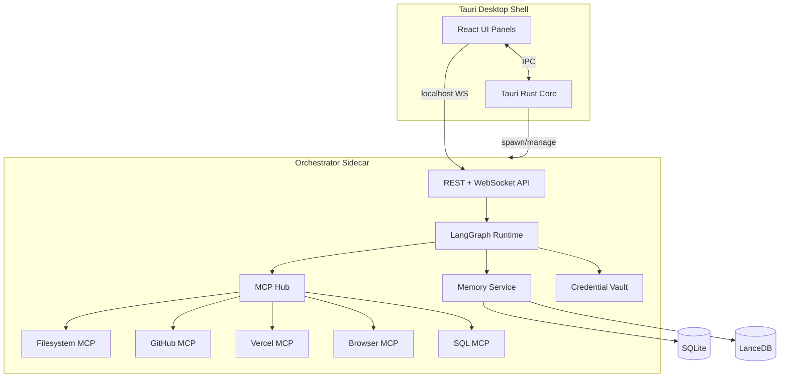
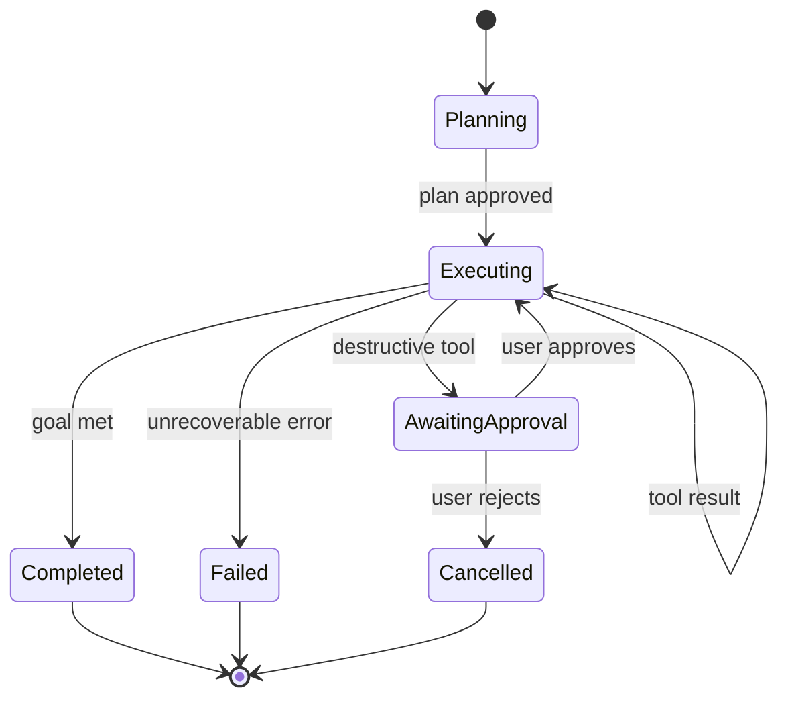

# Atomic-Workstation MVP - Plan

## Goal Capsule

- **Objective:** Ship a self-hostable, desktop-first local AI workstation that unifies projects, terminals, code editing, browser verification, agent workflows, and connected tools in one environment — proving the "operate the work" thesis with three end-to-end reference workflows.
- **Authority hierarchy:** This plan's Product Contract defines scope; Key Technical Decisions resolve architecture forks; implementation details not specified here are left to the implementer within stated patterns.
- **Stop conditions:** Stop and surface a blocker if a KTD assumption is invalidated (e.g., Tauri sidecar limits block required integrations), if a reference workflow cannot complete without cloud-only APIs, or if security review flags credential handling as inadequate for self-host.
- **Execution profile:** Phased delivery — MVP first (shell + agent + 3 workflows), then memory depth and connector expansion. Prefer characterization tests on orchestration boundaries; smoke-first for packaging.
- **Tail ownership:** `ce-work` or human implementer owns commits, CI, and PR landing per repo conventions once execution begins.

---

## Product Contract

### Summary

Atomic-Workstation is a local AI workspace where builders run entire workflows — not isolated tasks — across code, terminals, browsers, and connected services without losing context. The MVP delivers a Tauri desktop app with an orchestrator sidecar, MCP-based tool connectivity, multi-project workspaces, reusable agent workflows, and lightweight project memory, packaged for self-host via Docker Compose alongside a native installer.

### Problem Frame

Modern builders juggle editors, terminals, browsers, dashboards, deployment tools, email, and scattered AI apps. Each tool holds a slice of context; the human becomes the integration layer. AI assistants help inside one tab while the workflow stays fragmented across disconnected systems. The bottleneck is no longer writing code — it is operating across too many systems without flow.

Atomic-Workstation addresses orchestration: one visual workstation with system-wide context, persistent project memory, and agents that act across tools rather than inside a single sandbox.

### Requirements

**Platform & deployment**

- R1. The product runs as a desktop-first application on macOS, Windows, and Linux with native installers produced from CI.
- R2. The same orchestrator stack runs self-hosted via Docker Compose for headless or LAN-server deployments without requiring the desktop shell.
- R3. Users bring their own API keys for cloud LLM providers; local inference via Ollama-compatible endpoints is supported. No user data is sent for model training.
- R4. All project data, credentials, workflow state, and memory stores default to local disk under a user-configurable data directory.

**Workspace & projects**

- R5. Users create workspaces containing multiple projects (git repos or folders), each with isolated terminal sessions, editor state, and agent context.
- R6. Switching projects restores prior panel layout, open files, terminal cwd, and last agent thread without manual re-setup.
- R7. A project dashboard shows git status, recent agent runs, connected integrations, and memory stats at a glance.

**Work surfaces**

- R8. The shell provides dockable panels: code editor, terminal, browser, agent chat, database/query (read-only MVP), and integration status.
- R9. The code editor supports syntax highlighting, multi-tab editing, and file tree navigation for the active project.
- R10. Terminals are full PTY sessions scoped to the active project root, persistable across project switches.
- R11. The browser panel connects to a local Playwright-controlled browser for navigation, screenshots, and DOM inspection during agent workflows.

**Agent & orchestration**

- R12. An agent runtime executes multi-step workflows with tool calls, human approval gates for destructive actions, and streaming status to the UI.
- R13. Tools are exposed via an MCP hub that manages server lifecycle (stdio and Streamable HTTP transports), capability discovery, and per-workspace configuration.
- R14. Users can save, name, parameterize, and re-run agent workflows (templates) scoped to a workspace or project.
- R15. Destructive tool actions (deploy, send email, delete files, push git) require explicit user approval before execution.

**Memory**

- R16. Each project maintains a local memory store combining document chunks (RAG), structured facts, and relationship edges between entities (repos, services, env vars, deploy targets).
- R17. Agents automatically ingest project artifacts (README, package manifests, infra configs, recent git activity) into memory on project add and on demand.
- R18. Memory retrieval fuses vector similarity and graph traversal so agents answer "how does this project deploy?" without re-explaining the stack.

**Connected ecosystem (MVP connectors)**

- R19. GitHub connector: list repos, read PR/issue context, view recent commits and diffs.
- R20. Vercel connector: list deployments, read build logs, trigger redeploy (with approval).
- R21. PostgreSQL/SQLite connector: run read queries and return tabular results for analytics-style workflows.
- R22. Connector credentials are stored encrypted at rest in the local vault; never logged or transmitted except to the target service.

**Reference workflows (MVP acceptance bar)**

- R23. **Failed deployment fix:** Agent reads Vercel build logs, locates error in repo, proposes code fix, opens browser to verify dev server, redeploys with approval.
- R24. **Dev standup prep:** Agent aggregates git activity, open PRs, and deployment status into a paste-ready standup summary.
- R25. **Update hero and verify live:** Agent edits a named component, previews on dev server in browser panel, deploys to Vercel, confirms live URL.

### Actors

- A1. **Builder** — primary user running projects and agent workflows locally.
- A2. **Agent runtime** — autonomous executor within approval boundaries.
- A3. **MCP servers** — tool providers (filesystem, git, GitHub, Vercel, database, browser).
- A4. **Orchestrator service** — sidecar process managing agents, memory, connectors, and WebSocket API.

### Key Flows

- F1. **Project switch**
  - **Trigger:** User selects a different project in the sidebar.
  - **Actors:** A1, A4
  - **Steps:** Serialize current panel state → load target project state → restore terminals and editor tabs → attach agent thread → refresh dashboard.
  - **Outcome:** Context switch completes in under 2 seconds for typical projects; no data loss.
  - **Covered by:** R5, R6, R8, R10

- F2. **Workflow execution**
  - **Trigger:** User runs a saved workflow or freeform agent task.
  - **Actors:** A1, A2, A3, A4
  - **Steps:** Load workflow template → inject project memory context → plan steps → execute tools via MCP → pause at approval gates → stream progress → persist run log.
  - **Outcome:** Run completes or fails with actionable error; all tool calls auditable.
  - **Covered by:** R12, R13, R14, R15

- F3. **Memory ingestion**
  - **Trigger:** Project added or user triggers re-index.
  - **Actors:** A4
  - **Steps:** Scan project files → chunk and embed → extract entities/relationships → upsert graph → update dashboard stats.
  - **Outcome:** Agent queries return project-specific context within 5 seconds for repos under 10k files.
  - **Covered by:** R16, R17, R18

### Acceptance Examples

- AE1. **Failed deployment fix**
  - **Covers:** R23, F2
  - **Given:** A project linked to GitHub and Vercel with a failing deployment and build log containing a TypeScript error.
  - **When:** The user runs the "Fix failed deployment" workflow.
  - **Then:** The agent surfaces the error, proposes a patch, shows the fix in the editor, verifies on the dev server in the browser panel, and redeploys only after user approval; the run log records each tool call.

- AE2. **Dev standup prep**
  - **Covers:** R24, F2
  - **Given:** A project with commits in the last 24 hours and at least one open PR.
  - **When:** The user runs "Standup prep."
  - **Then:** A markdown summary appears with yesterday's commits, PR status, and deployment state, copyable in one click.

- AE3. **Hero update and verify**
  - **Covers:** R25, F2
  - **Given:** A web project with a identifiable hero component and a running dev script.
  - **When:** The user asks the agent to update hero copy and verify live.
  - **Then:** The editor shows the diff, the browser panel renders the dev preview, and post-approval deploy opens the production URL for confirmation.

### Success Criteria

- A new user can install, add a project, connect GitHub + Vercel, and complete AE1–AE3 on a sample repo without leaving the app.
- Cold start to first agent response under 10 seconds on a machine with 16GB RAM (excluding initial model download).
- Self-hosted Docker deployment passes the same API contract tests as the desktop sidecar.
- Zero credentials appear in logs, workflow exports, or crash reports.

### Scope Boundaries

**In scope (MVP)**

- Desktop shell, orchestrator, MCP hub, three reference workflows, GitHub/Vercel/DB connectors, lightweight knowledge graph + RAG, Docker self-host.

**Deferred for later**

- Gmail/email drafting and send (use cases 1, 5, 8 from product vision).
- Slack, Supabase, and additional SaaS connectors beyond GitHub/Vercel.
- Competitive site audit workflow (browser-heavy multi-site analysis).
- Weekly metrics HTML email report generation.
- Team multi-user RBAC, audit dashboards, and org-wide connector permission sync.
- Native mobile clients.

**Outside this product's identity**

- Hosted multi-tenant SaaS with vendor-managed keys.
- Training or fine-tuning models on user data.
- Replacing full IDEs (VS Code/JetBrains) — the editor is for agent-assisted edits, not a complete IDE replacement.

### Outstanding Questions

- Q1. (Deferred) Email provider for deferred Gmail workflows — OAuth vs app-password vs defer entirely to Phase 2.
- Q2. (Deferred) Commercial licensing model for self-host vs desktop — does not block MVP implementation.

---

## Planning Contract

### Assumptions

- MVP targets a single-user local deployment; multi-tenant auth is out of scope.
- Reference workflows run against a bundled sample Next.js + Vercel project for CI and onboarding.
- Users have Node.js 20+ available for development; production bundles the orchestrator binary.
- Ollama is optional; cloud BYOK is the default path for capable models in MVP demos.

### Key Technical Decisions

- **KTD1. Tauri 2 + React for the desktop shell** — Chosen over Electron for ~85% lower idle RAM footprint, critical when local LLMs compete for memory. Rust layer handles windowing, secure credential storage (OS keychain via `keyring` crate), and sidecar lifecycle. Trade-off: smaller plugin ecosystem vs Electron; acceptable for a custom UI.

- **KTD2. TypeScript orchestrator as a Tauri sidecar** — A Node.js 20 service (`apps/orchestrator`) runs as a bundled sidecar communicating over localhost WebSocket + REST. Chosen over embedding logic in Rust for faster MCP/agent iteration and npm ecosystem access. Trade-off: separate process management; mitigated by Tauri sidecar APIs and health checks.

- **KTD3. MCP as the integration backbone** — All tools (filesystem, git, GitHub, Vercel, browser, SQL) expose capabilities via MCP servers managed by a central hub. Chosen over bespoke adapters per integration for portability with Cursor/Claude Desktop patterns and community servers. Trade-off: MCP does not orchestrate — a separate agent runtime owns planning loops.

- **KTD4. LangGraph for agent workflow execution** — Chosen over raw LangChain agents or CrewAI for explicit state machines, human-in-the-loop interrupts, and durable checkpointing. Workflows compile to graphs; templates are serialized graph definitions. Trade-off: dependency weight; acceptable for orchestration clarity.

- **KTD5. Hybrid memory: SQLite + LanceDB + property graph tables** — Rather than requiring Neo4j, store entities and edges in SQLite tables with vector embeddings in LanceDB (embedded, zero-config). Graph traversal via SQL recursive CTEs for MVP; upgrade path to Graphiti/Neo4j documented. Chosen for single-binary self-host simplicity.

- **KTD6. Playwright via MCP browser server** — Browser panel attaches to a Playwright MCP server using CDP; screenshots and navigation are agent tools. Chosen over embedded WebView alone because agents need programmatic DOM access and multi-tab control.

- **KTD7. Monorepo with pnpm workspaces** — `apps/desktop` (Tauri), `apps/orchestrator`, `packages/ui`, `packages/shared`, `packages/mcp-hub`, `packages/memory`, `packages/workflows`. Enables shared types between shell and orchestrator.

- **KTD8. Self-host via Docker Compose** — `deploy/docker-compose.yml` runs orchestrator + optional Ollama + memory volumes. Desktop app can target local or remote orchestrator URL. API contract identical; auth via single-user API token in MVP.

### High-Level Technical Design



**Agent run lifecycle**



**Project context model**

| Entity | Relationships | Stored in |
| --- | --- | --- |
| Workspace | contains Projects | SQLite |
| Project | has Terminals, Files, Memory, Connectors | SQLite |
| AgentRun | belongs to Project; invokes Tools | SQLite + run log files |
| MemoryNode | relates to MemoryNode via typed edges | SQLite + LanceDB vectors |
| WorkflowTemplate | scoped to Workspace/Project | SQLite JSON |

### Output Structure

```text
atomic-workstation/
├── apps/
│   ├── desktop/                 # Tauri 2 + React shell
│   │   ├── src/                   # React UI
│   │   └── src-tauri/             # Rust: sidecar, keychain, windowing
│   └── orchestrator/            # Node sidecar: API, agents, MCP, memory
├── packages/
│   ├── shared/                  # Types, constants, API client
│   ├── ui/                      # Shared React components (design system)
│   ├── mcp-hub/                 # MCP server registry + lifecycle
│   ├── memory/                  # Ingestion, RAG, graph queries
│   └── workflows/               # LangGraph workflow definitions
├── deploy/
│   ├── docker-compose.yml
│   └── Dockerfile.orchestrator
├── examples/
│   └── sample-next-app/         # Reference project for AE1–AE3
├── docs/
│   └── plans/
├── pnpm-workspace.yaml
└── package.json
```

### System-Wide Impact

- **End users:** Install desktop app or Docker stack; configure API keys once; add projects and connectors.
- **Developers:** Monorepo with shared types; orchestrator API is the integration surface for future panels.
- **Operations:** Self-hosters mount a single data volume; backups are filesystem copies of the data directory.
- **Security:** Credential vault and approval gates are cross-cutting; every connector and destructive tool path must pass through them.
- **Agent parity:** Every user-visible action (deploy, query, browse, edit) must have an MCP tool equivalent so workflows do not require UI-only steps.

### Risks & Dependencies

| Risk | Mitigation |
| --- | --- |
| Tauri sidecar packaging complexity across OS targets | CI matrix builds early; use `tauri-plugin-shell` sidecar config with platform triples |
| MCP server ecosystem instability | Pin server versions; vendor minimal forks for GitHub/Vercel if upstream gaps |
| LangGraph API churn | Lock version; wrap behind internal `AgentRuntime` interface |
| Playwright binary size in installer | Download on first use; optional component in installer |
| Graph memory quality insufficient for infra questions | MVP uses hybrid retrieval; defer Graphiti integration if CTE traversal underperforms |
| Connector OAuth flows in desktop apps | Use loopback redirect via localhost callback server in orchestrator |

### Phased Delivery

| Phase | Units | Outcome |
| --- | --- | --- |
| **P0 Foundation** | U1–U3 | Runnable shell, orchestrator, project switching |
| **P1 Work surfaces** | U4, U8 | Editor, terminal, browser panels |
| **P2 Agent core** | U5, U6, U7 | MCP hub, agent runtime, workflow templates |
| **P3 Memory & connectors** | U9, U10 | Project memory, GitHub/Vercel/DB |
| **P4 Ship** | U11, U12 | Docker self-host, reference workflows, installers |

### Alternatives Considered

| Alternative | Why not (MVP) |
| --- | --- |
| Electron shell | 600MB+ idle RAM unacceptable alongside local LLMs |
| All-Rust orchestrator | Slower iteration for MCP/agent ecosystem; revisit for performance-critical path |
| Custom tool adapters (no MCP) | Duplicates community work; worse interoperability with existing agent tools |
| Neo4j for memory | Operational burden for self-host; SQLite graph sufficient for MVP scale |
| Embedded IDE (Code-OSS) | Massive scope; Monaco covers agent-edit use cases |
| Web-only (no desktop) | Conflicts with desktop-first positioning; Docker covers headless need |

### Sources & Research

- Tauri 2 sidecar pattern for local AI apps: lower memory vs Electron (~80MB vs 600MB idle).
- MCP host-client-server architecture: stdio for local tools, Streamable HTTP for remote; hub pattern for shared daemon.
- Hybrid memory (RAG + graph + session): 2026 production pattern per enterprise agent memory guides; Graphiti as Phase 2 upgrade.
- Landscape: Open WebUI/LibreChat (chat-first), AnythingLLM (doc RAG), Onyx (enterprise connectors) — Atomic-Workstation differentiates on workflow orchestration across dev tools, not chat-only or search-only.

---

## Implementation Units

| U-ID | Title | Primary paths | Depends on |
| --- | --- | --- | --- |
| U1 | Monorepo and Tauri shell scaffold | `package.json`, `apps/desktop/` | — |
| U2 | Orchestrator sidecar and API | `apps/orchestrator/`, `packages/shared/` | U1 |
| U3 | Workspace and project management | `apps/orchestrator/src/projects/`, `apps/desktop/src/features/projects/` | U2 |
| U4 | Editor and terminal panels | `apps/desktop/src/panels/`, `packages/ui/` | U3 |
| U5 | MCP hub and credential vault | `packages/mcp-hub/`, `apps/orchestrator/src/vault/` | U2 |
| U6 | Agent runtime and LLM providers | `apps/orchestrator/src/agent/`, `packages/workflows/` | U5 |
| U7 | Workflow templates and run UI | `packages/workflows/`, `apps/desktop/src/features/workflows/` | U6 |
| U8 | Browser panel and Playwright MCP | `apps/desktop/src/panels/browser/`, MCP browser server config | U5 |
| U9 | Project memory ingestion and retrieval | `packages/memory/` | U3 |
| U10 | GitHub, Vercel, and SQL connectors | `packages/mcp-hub/servers/`, connector configs | U5, U9 |
| U11 | Docker self-host distribution | `deploy/` | U2 |
| U12 | Reference workflows and sample project | `examples/sample-next-app/`, workflow templates | U7, U8, U10 |

### U1. Monorepo and Tauri shell scaffold

- **Goal:** Bootstrapped monorepo with Tauri 2 desktop app opening a React shell window.
- **Requirements:** R1, R4
- **Dependencies:** None
- **Files:** `package.json`, `pnpm-workspace.yaml`, `apps/desktop/package.json`, `apps/desktop/src-tauri/tauri.conf.json`, `apps/desktop/src-tauri/src/main.rs`, `apps/desktop/src/main.tsx`, `apps/desktop/src/App.tsx`, `packages/shared/package.json`, `packages/ui/package.json`
- **Approach:** Initialize pnpm workspace. Scaffold Tauri 2 with React + TypeScript + Vite. Configure `apps/desktop` to resolve `@atomic/ui` and `@atomic/shared`. Set up cyberpunk-dark design tokens in `packages/ui` (neon cyan/magenta palette per product identity). Rust main process loads window with minimum size 1280×800.
- **Patterns to follow:** Tauri 2 capability-based permissions in `src-tauri/capabilities/default.json`.
- **Test scenarios:**
  - App launches on Linux CI headless build without runtime errors.
  - Workspace packages resolve via `pnpm -r build`.
  - Tauri config declares sidecar placeholder for orchestrator binary.
- **Verification:** `pnpm install && pnpm -r build` succeeds; `pnpm --filter desktop tauri build` produces an artifact on CI.

### U2. Orchestrator sidecar and API

- **Goal:** Node orchestrator runs as a Tauri-managed sidecar exposing health, project, and agent stub endpoints over localhost.
- **Requirements:** R2, R4
- **Dependencies:** U1
- **Files:** `apps/orchestrator/package.json`, `apps/orchestrator/src/index.ts`, `apps/orchestrator/src/server.ts`, `apps/orchestrator/src/routes/health.ts`, `packages/shared/src/api-types.ts`, `apps/desktop/src-tauri/src/sidecar.rs`
- **Approach:** Fastify server with WebSocket plugin. Tauri spawns sidecar on app start; React polls `/health` until ready. Shared Zod schemas in `packages/shared`. Data directory defaults to `~/.atomic-workstation`. Graceful shutdown on app quit.
- **Execution note:** Start with a failing contract test for `/health` and WebSocket connect before implementing handlers.
- **Patterns to follow:** Tauri 2 `shell` plugin sidecar configuration with `externalBin` per platform triple.
- **Test scenarios:**
  - `/health` returns 200 with version when orchestrator is running.
  - Sidecar restarts after simulated crash; desktop reconnects within 10 seconds.
  - Data directory is created on first run with correct permissions.
- **Verification:** Integration test spawns orchestrator and asserts health + WS handshake.

### U3. Workspace and project management

- **Goal:** Users create workspaces, add/remove projects, and switch between them with state persistence.
- **Requirements:** R5, R6, R7, F1
- **Dependencies:** U2
- **Files:** `apps/orchestrator/src/projects/workspace-store.ts`, `apps/orchestrator/src/projects/project-store.ts`, `apps/orchestrator/src/routes/workspaces.ts`, `apps/orchestrator/src/routes/projects.ts`, `apps/desktop/src/features/projects/ProjectSidebar.tsx`, `apps/desktop/src/features/projects/ProjectDashboard.tsx`, `apps/desktop/src/stores/project-store.ts`
- **Approach:** SQLite schema for workspaces and projects (path, name, git remote, connector refs). Project switch API serializes/restores panel state JSON per project. Dashboard aggregates git status via simple `git` subprocess and connector health.
- **Test scenarios:**
  - Create workspace with two projects; switch between them; each restores distinct terminal cwd.
  - Remove project deletes associated state but not files on disk.
  - Dashboard shows branch name and dirty count for git repos.
  - Covers F1: switch completes without losing open editor tabs.
- **Verification:** API integration tests for CRUD + switch; Playwright smoke for sidebar interaction.

### U4. Editor and terminal panels

- **Goal:** Dockable Monaco editor and xterm.js terminal panels bound to the active project.
- **Requirements:** R8, R9, R10
- **Dependencies:** U3
- **Files:** `apps/desktop/src/panels/editor/EditorPanel.tsx`, `apps/desktop/src/panels/editor/FileTree.tsx`, `apps/desktop/src/panels/terminal/TerminalPanel.tsx`, `apps/orchestrator/src/terminal/pty-manager.ts`, `apps/orchestrator/src/routes/terminal.ts`, `packages/ui/src/PanelLayout.tsx`
- **Approach:** Orchestrator owns PTY processes via `node-pty`; WebSocket streams stdin/stdout. Editor loads files through orchestrator filesystem API (path-scoped to project root). Panel layout uses resizable dock (e.g., `react-resizable-panels`). File tree watches project root with debounced refresh.
- **Test scenarios:**
  - Open file, edit, save — disk reflects changes under project root.
  - Terminal runs `pwd` and returns project root path.
  - Multiple terminal tabs persist labels and cwd per project.
  - Switching projects destroys old PTY sessions and restores saved ones.
- **Verification:** Manual smoke + API test for PTY echo; editor save round-trip unit test.

### U5. MCP hub and credential vault

- **Goal:** Central registry spawns and manages MCP servers; credentials stored in OS keychain with encrypted SQLite fallback.
- **Requirements:** R13, R22, KTD3
- **Dependencies:** U2
- **Files:** `packages/mcp-hub/src/registry.ts`, `packages/mcp-hub/src/lifecycle.ts`, `packages/mcp-hub/src/transports/stdio.ts`, `packages/mcp-hub/src/transports/http.ts`, `apps/orchestrator/src/vault/credential-store.ts`, `apps/orchestrator/src/routes/connectors.ts`, `apps/desktop/src/features/settings/ConnectorSettings.tsx`
- **Approach:** Hub maintains one stdio process per configured server per workspace. `tools/list` results cached with TTL. Vault stores connector tokens via Tauri `keyring` command on desktop; Docker mode uses encrypted file with env-provided master key. UI for adding GitHub PAT and Vercel token.
- **Test scenarios:**
  - Register filesystem MCP server; `tools/list` returns expected tools.
  - Invalid credential returns error without logging secret.
  - Restart hub reconnects servers without user re-entry.
  - HTTP transport MCP server connects when configured with localhost URL.
- **Verification:** Integration test with official filesystem MCP server; vault round-trip test.

### U6. Agent runtime and LLM providers

- **Goal:** LangGraph-based agent executes tool loops with streaming events and human approval interrupts.
- **Requirements:** R3, R12, R15, KTD4
- **Dependencies:** U5
- **Files:** `apps/orchestrator/src/agent/runtime.ts`, `apps/orchestrator/src/agent/providers/openai.ts`, `apps/orchestrator/src/agent/providers/anthropic.ts`, `apps/orchestrator/src/agent/providers/ollama.ts`, `apps/orchestrator/src/agent/approval-gate.ts`, `apps/orchestrator/src/routes/agent.ts`, `packages/workflows/src/graph-builder.ts`
- **Approach:** Provider interface abstracts OpenAI, Anthropic, and Ollama (OpenAI-compatible). LangGraph graph: plan → execute tool → check approval → continue. Destructive tools tagged in MCP metadata; runtime pauses and emits `awaiting_approval` WS event. Run state checkpointed to SQLite for resume.
- **Execution note:** Implement provider contract tests with mocked LLM before wiring live keys.
- **Test scenarios:**
  - Agent calls filesystem read tool and returns content in stream.
  - Destructive tool triggers approval gate; run resumes only after approve API call.
  - Ollama provider works against local endpoint when configured.
  - Run failure surfaces last tool error in UI event.
- **Verification:** Unit tests for approval gate; integration test with mock LLM and real filesystem MCP.

### U7. Workflow templates and run UI

- **Goal:** Users save, browse, and execute reusable workflow templates with parameters.
- **Requirements:** R14, F2
- **Dependencies:** U6
- **Files:** `packages/workflows/src/templates/`, `packages/workflows/src/template-store.ts`, `apps/orchestrator/src/routes/workflows.ts`, `apps/desktop/src/features/workflows/WorkflowLibrary.tsx`, `apps/desktop/src/features/workflows/RunTimeline.tsx`, `apps/desktop/src/features/agent/AgentChat.tsx`
- **Approach:** Templates are LangGraph graph definitions + parameter schema (Zod). Built-in templates ship for AE1–AE3. UI shows run timeline with tool call cards, approval prompts inline. Freeform chat creates ad-hoc runs using same runtime.
- **Test scenarios:**
  - Save custom workflow; appears in library; re-run with different parameters.
  - Run timeline shows ordered steps with durations.
  - Covers F2: template run persists log retrievable after completion.
- **Verification:** Template serialization round-trip test; UI component tests for timeline rendering.

### U8. Browser panel and Playwright MCP

- **Goal:** Embedded browser panel controlled by Playwright MCP for agent navigation and screenshots.
- **Requirements:** R11, KTD6
- **Dependencies:** U5
- **Files:** `apps/desktop/src/panels/browser/BrowserPanel.tsx`, `packages/mcp-hub/servers/browser-config.ts`, `apps/orchestrator/src/routes/browser.ts`
- **Approach:** Playwright MCP server registered in hub. Browser panel displays latest screenshot stream and URL bar; agent tools update view. CDP URL exposed for advanced debugging. First-run downloads Playwright browsers if missing.
- **Test scenarios:**
  - Agent navigates to `http://localhost:3000` and screenshot appears in panel.
  - User manual URL entry loads page.
  - Browser server restart recovers without desktop restart.
- **Verification:** Integration test: start sample static server, agent screenshot tool returns image bytes.

### U9. Project memory ingestion and retrieval

- **Goal:** Automatic project indexing with hybrid vector + graph retrieval for agent context.
- **Requirements:** R16, R17, R18, F3, KTD5
- **Dependencies:** U3
- **Files:** `packages/memory/src/ingest.ts`, `packages/memory/src/chunker.ts`, `packages/memory/src/embedder.ts`, `packages/memory/src/graph-store.ts`, `packages/memory/src/retriever.ts`, `apps/orchestrator/src/routes/memory.ts`
- **Approach:** On project add, ingest README, package.json, docker-compose, `.env.example`, and recent git log. Chunk markdown/code; embed with local CPU model (e.g., `transformers.js` or `gte-small` via ONNX). Extract entities (service names, deploy targets, ports) into `memory_edges` table. Retriever fuses top-k vectors with 1-hop graph neighbors.
- **Test scenarios:**
  - Ingest sample project; query "how does this deploy?" returns Vercel-related chunks.
  - Re-index replaces stale chunks without duplicates.
  - Covers F3: dashboard shows node/edge counts after ingest.
  - Graph edge: `project` → `deploys_to` → `vercel` retrievable.
- **Verification:** Unit tests for chunker and graph queries; retrieval recall test against fixture project.

### U10. GitHub, Vercel, and SQL connectors

- **Goal:** MCP-backed connectors for GitHub, Vercel, and read-only SQL queries.
- **Requirements:** R19, R20, R21, R22
- **Dependencies:** U5, U9
- **Files:** `packages/mcp-hub/servers/github.ts`, `packages/mcp-hub/servers/vercel.ts`, `packages/mcp-hub/servers/sql.ts`, `apps/orchestrator/src/connectors/github.ts`, `apps/orchestrator/src/connectors/vercel.ts`, `apps/desktop/src/features/settings/ConnectorSettings.tsx`
- **Approach:** Wrap official or community MCP servers where available; thin custom servers for gaps. GitHub: list PRs, get diff, list commits. Vercel: list deployments, get build logs, create deployment (approval-gated). SQL: SQLite file or Postgres connection string; read-only `SELECT` with row limit. Credentials from vault only.
- **Test scenarios:**
  - GitHub connector returns open PRs for configured repo (mocked in CI).
  - Vercel connector fetches build log given deployment ID.
  - SQL connector rejects `INSERT`/`DELETE` statements.
  - Covers AE1 prerequisite: build log retrievable by agent tool.
- **Verification:** Contract tests with recorded HTTP fixtures (nock/msw).

### U11. Docker self-host distribution

- **Goal:** One-command Docker Compose stack running the orchestrator for headless self-host.
- **Requirements:** R2, KTD8
- **Dependencies:** U2
- **Files:** `deploy/docker-compose.yml`, `deploy/Dockerfile.orchestrator`, `deploy/.env.example`, `docs/self-host.md`
- **Approach:** Multi-stage Dockerfile builds orchestrator. Compose services: `orchestrator`, optional `ollama`. Volume mount for data dir. Document API token auth and connecting desktop app to `ORCHESTRATOR_URL`. Healthcheck on `/health`.
- **Test scenarios:**
  - `docker compose up` yields healthy orchestrator within 60 seconds.
  - Data persists across container restart via mounted volume.
  - Desktop app connects to remote orchestrator when configured.
- **Verification:** CI job runs compose smoke test.

### U12. Reference workflows and sample project

- **Goal:** Bundled sample Next.js app and three workflow templates satisfying AE1–AE3.
- **Requirements:** R23, R24, R25, AE1, AE2, AE3
- **Dependencies:** U7, U8, U10
- **Files:** `examples/sample-next-app/`, `packages/workflows/src/templates/fix-deployment.ts`, `packages/workflows/src/templates/standup-prep.ts`, `packages/workflows/src/templates/update-hero.ts`, `apps/orchestrator/src/seed/demo-workspace.ts`
- **Approach:** Sample app includes intentional deploy-breaking commit (fixable TS error), hero component, and git history. Seed command creates demo workspace with pre-wired connectors (mock mode for CI). Templates orchestrate tool sequences documented in AE1–AE3. E2E script runs all three workflows in mock-connector mode.
- **Execution note:** Add end-to-end workflow test before polishing UI timeline details.
- **Test scenarios:**
  - Covers AE1: fix-deployment workflow reaches approval gate before redeploy.
  - Covers AE2: standup output includes commits and PR section.
  - Covers AE3: hero edit appears in browser screenshot diff.
  - Demo seed is idempotent.
- **Verification:** E2E test suite runs AE1–AE3 against sample app; documented onboarding path completes in README.

---

## Verification Contract

| Gate | Command / check | When |
| --- | --- | --- |
| Unit tests | `pnpm -r test` | Every commit |
| Typecheck | `pnpm -r typecheck` | Every commit |
| Lint | `pnpm -r lint` | Every commit |
| Orchestrator integration | `pnpm --filter orchestrator test:integration` | PR |
| Desktop E2E | `pnpm --filter desktop test:e2e` | PR (AE1–AE3) |
| Docker smoke | `docker compose -f deploy/docker-compose.yml up --wait` | PR |
| Desktop build | `pnpm --filter desktop tauri build` | Release |
| Security | Secret scan + verify no credentials in logs fixture test | PR |

---

## Definition of Done

**Global**

- All R1–R25 requirements trace to at least one implementation unit and test scenario.
- AE1, AE2, AE3 pass in CI (mock connectors) and manually with real GitHub/Vercel tokens.
- Desktop installers build for macOS, Windows, and Linux on CI.
- Docker Compose self-host documented and smoke-tested.
- No P0/P1 security findings in credential handling or approval gates.
- Abandoned experimental code from implementation removed before merge.

**Per-unit**

| Unit | Done when |
| --- | --- |
| U1 | Monorepo builds; Tauri window opens |
| U2 | Sidecar health + WS proven |
| U3 | Project switch restores state (F1) |
| U4 | Editor save + terminal PTY work |
| U5 | MCP hub lists tools; vault stores/retrieves secrets |
| U6 | Agent completes tool loop with approval gate |
| U7 | Templates save, run, and show timeline |
| U8 | Browser screenshot via agent tool |
| U9 | Memory ingest + hybrid retrieval returns deploy context |
| U10 | GitHub/Vercel/SQL connectors pass contract tests |
| U11 | Docker compose healthy; data persists |
| U12 | AE1–AE3 E2E green |

---

## Appendix

### Deferred connector roadmap (post-MVP)

| Connector | Use cases unlocked |
| --- | --- |
| Gmail (OAuth) | Bug report → fix → reply; weekly metrics email |
| Slack | Standup posting; alert triage |
| Supabase | Analytics queries from plain English |
| Generic webhook | Custom CI/deploy triggers |

### Memory upgrade path

If SQLite graph traversal proves insufficient for multi-hop infra queries, integrate Graphiti as an optional memory backend behind the same `packages/memory` retriever interface without changing agent or UI contracts.

### UI design notes

Apply NeuroRainbow Cyberpunk identity: `#05070D` background, neon cyan (`#00E5FF`) and magenta (`#FF00AA`) accents, glassmorphism panels, Orbitron/Space Grotesk typography. Prioritize neurodivergent-friendly UX: persistent nav, visible system status, chunked workflow timeline, no hidden state changes.
