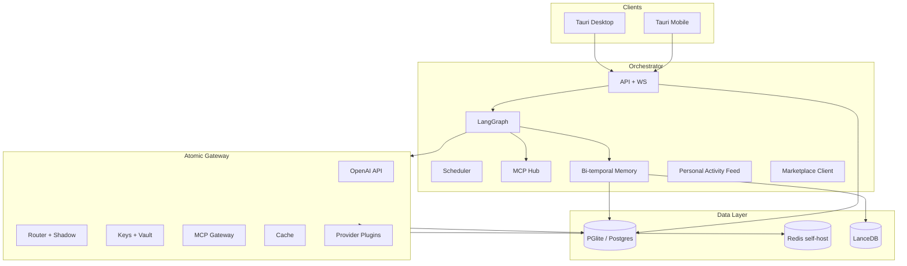

# Atomic-Workstation Full Platform - Plan

## Goal Capsule

- **Objective:** Deliver the complete Atomic-Workstation platform end-to-end — desktop and mobile clients, self-hosted Docker and Kubernetes distributions, first-party Atomic Gateway with full provider catalog and personal spend controls, modern workbench, bi-temporal knowledge graph, full connector ecosystem, and all eight marketing reference workflows — with zero deferred product scope.
- **Target user:** Solo inventors and vibe coders — one person shipping side projects, not enterprise teams.
- **Authority hierarchy:** Product Contract is exhaustive; Planning Contract KTDs resolve architecture; unspecified implementation detail is left to the implementer within stated patterns.
- **Stop conditions:** Surface blockers only for physically impossible constraints (e.g., provider revokes API entirely); do not defer scope — resolve with documented assumptions instead.
- **Execution profile:** Ten delivery phases, **31 implementation units** (U1–U25, U27–U32; U26 removed). Sequenced via **Delivery Tiers** (T1 Solo GA → T2 Power → T3 Full); all R1–R96 ship by T3. Contract-test gateway OpenAI surface first; FOSS inventory (R96) enforced in CI from P0; E2E all eight workflows in CI before T3 release.
- **Tail ownership:** Implementer owns commits, CI, installers, Helm charts, and mobile store submission artifacts.

---

## Product Contract

### Summary

Atomic-Workstation is a local-first, self-hostable AI workstation for **solo inventors and vibe coders** who operate entire workflows across code, terminals, browsers, email, databases, chat, and deployment tools in one environment — without team admin overhead. The complete platform includes: Tauri desktop + Tauri mobile apps, orchestrator sidecar, **Atomic Gateway** (first-party OpenAI-compatible AI/MCP gateway), bi-temporal project knowledge graph, reusable agent workflows with scheduling, personal spend controls, plugin marketplace, and connectors for GitHub, Vercel, Gmail, Supabase, Slack, and generic webhooks.

**Solo-first identity:** One local user per install. OS keychain / biometric unlock protects vault secrets. No org hierarchies, multi-user RBAC, or enterprise SSO — those are explicit non-goals (see Scope Boundaries).

**FOSS-first AI stack:** Wherever a mature open-source AI SDK exists, we use it instead of bespoke HTTP clients or proprietary middleware. Atomic Gateway owns routing, keys, budgets, and policy — provider adapters wrap FOSS SDKs; agents and UI compose FOSS orchestration and streaming libraries on top.

**Scope policy:** No feature is deferred out of the program. Requirements R1–R96 all ship by **Tier 3 (Full)**. **Delivery Tiers** (T1–T3) sequence implementation and define milestone exit criteria — not scope cuts.

### Problem Frame

Builders lose flow switching between editors, terminals, browsers, dashboards, email, and scattered AI tabs. AI helps inside one surface while the workflow stays fragmented. Solo inventors and vibe coders juggle multiple side projects alone — they need one environment that remembers context, routes models cheaply, and runs cross-tool workflows without standing up team infrastructure. Atomic-Workstation unifies personal work orchestration: system-wide context, persistent memory, native gateway, and agents that execute real workflows locally with your keys.

### Requirements

**Platform & distribution**

- R1. Desktop app: macOS, Windows, Linux native installers via CI.
- R2. Mobile companion apps: iOS and Android via Tauri 2 mobile (project switch, agent chat, workflow triggers, approvals, notifications).
- R3. Self-host Docker Compose: orchestrator, gateway, Postgres, Redis, Ollama (optional).
- R4. Self-host Kubernetes (T3): Helm chart with HA gateway, orchestrator, ingress, persistent volumes. Optional for solo users; Docker Compose (R3) is the default self-host path.
- R5. BYOK for all cloud providers; Ollama/vLLM for local inference; no training on user data.
- R6. All state in user-configurable data directory or mounted volumes.

**FOSS AI SDK mandate**

- R84. **FOSS-first policy:** All AI/ML integration code prefers OSI-approved open-source SDKs (MIT, Apache-2.0, BSD). Custom HTTP clients are allowed only when no maintained FOSS SDK exists for that provider.
- R85. **Gateway provider layer** wraps [Vercel AI SDK](https://github.com/vercel/ai) `@ai-sdk/*` provider packages (`@ai-sdk/openai`, `@ai-sdk/anthropic`, `@ai-sdk/google`, `@ai-sdk/amazon-bedrock`, `@ai-sdk/azure`, `@ai-sdk/mistral`, `@ai-sdk/groq`, `@ai-sdk/cohere`, `@ai-sdk/deepseek`, `@ai-sdk/fireworks`, `@ai-sdk/togetherai`, `@ai-sdk/xai`, `@ai-sdk/perplexity`, `@ai-sdk/openai-compatible` for Ollama/vLLM/LM Studio/LocalAI) inside `ProviderAdapter` implementations — not reimplemented REST.
- R86. **Official provider clients** supplement AI SDK where needed: `openai`, `@anthropic-ai/sdk`, `@google/generative-ai`, `@aws-sdk/client-bedrock-runtime`, `@huggingface/inference`, `ollama` npm package.
- R87. **Agent orchestration** uses `@langchain/langgraph` + `@langchain/core`; MCP tool binding via `@langchain/mcp-adapters`.
- R88. **Agent + UI streaming** uses Vercel `ai` package (`streamText`, `generateText`, tool calling) pointed at Atomic Gateway as the model provider.
- R89. **MCP protocol** implemented with official `@modelcontextprotocol/sdk` (client + server transports). Community MCP servers from `@modelcontextprotocol/server-*` used where applicable (filesystem, git, GitHub, etc.).
- R90. **Local embeddings** via `@xenova/transformers` (Transformers.js) and/or Ollama embed API; vector store in LanceDB (Apache-2.0).
- R91. **Token counting** via `js-tiktoken` / `@dqbd/tiktoken`; cost tables maintained in `packages/gateway-core`.
- R92. **Observability** via OpenTelemetry JS SDK + `prom-client`; optional self-hosted [Langfuse](https://github.com/langfuse/langfuse) (FOSS) for LLM trace UI.
- R93. **Guardrails** use FOSS libraries only: `redact-pii`, regex blocklists, custom JS/WASM plugins. No proprietary moderation SDKs in the default pipeline.
- R94. **Connector OAuth** via `openid-client` PKCE for Gmail, GitHub, Vercel, Slack, and MCP servers requiring user consent.
- R95. **Dependency governance:** `pnpm licenses` + SBOM (`@cyclonedx/cyclonedx-npm`) in CI; block copyleft licenses in runtime deps without explicit approval.
- R96. **FOSS SDK inventory** in `docs/foss-ai-stack.md`; REST-shim exceptions in `docs/foss-exceptions.md`; both kept in sync via `pnpm foss:check` CI.

**Atomic Gateway — API surface**

- R7. OpenAI-compatible: `/v1/chat/completions`, `/v1/completions`, `/v1/embeddings`, `/v1/images/generations`, `/v1/audio/transcriptions`, `/v1/audio/speech`, `/v1/models`, SSE streaming.
- R8. Drop-in for OpenAI SDK clients via `baseURL` only.
- R9. `gateway.yaml` + runtime CRUD API; hot reload without restart.
- R10. Master key + virtual key Bearer auth; signed JWT for **service-to-service** tokens (orchestrator ↔ gateway only; not multi-user accounts).
- R11. Pass-through endpoints for provider-native APIs.
- R12. Health, readiness, per-provider status.

**Atomic Gateway — providers (full catalog)**

- R13. Plugin `ProviderAdapter` interface: chat, embed, stream, image, audio, token count, cost estimate.
- R14. Ship adapters for all major providers by Tier 3. Families and tiers:

| Family | Providers | Tier |
| --- | --- | --- |
| US labs | OpenAI, Anthropic, xAI, Perplexity, Cohere, AI21 | T1 (core) / T3 (AI21) |
| Google | Gemini API, Vertex AI | T2 / T3 |
| Microsoft | Azure OpenAI, Azure AI Inference | T3 |
| Amazon | Bedrock, SageMaker endpoints | T2 / T3 |
| Open aggregators | OpenRouter, Together, Fireworks, Anyscale, DeepSeek, Groq, Mistral | T1 (subset) / T3 (full) |
| Local/self-host | Ollama, vLLM, LM Studio, llama.cpp server, LocalAI | T1 |
| Cloud ML | Replicate, HuggingFace Inference, Baseten, Modal | T2 / T3 |
| Enterprise | Snowflake Cortex, Databricks Foundation Models, Nvidia NIM | T3 (power-user) |
| Other | Cloudflare Workers AI, GitHub Models, Aleph Alpha, Watsonx (IBM) | T2 / T3 |

Providers without a maintained `@ai-sdk/*` package use documented REST shims listed in `docs/foss-exceptions.md` (R84 exception path).

- R15. Adapter marketplace: signed plugin bundles installable from workbench; local catalog in T2; optional remote catalog URL in T3. Community submission flow with schema validation (T3).
- R16. Model registry: alias → multiple deployments; tags for capability (vision, tools, json-mode). Implemented in `packages/gateway-core` (U13); admin UI in U20.

**Atomic Gateway — routing & reliability**

- R17. Retries, fallback chains, budget-fallbacks, cooldowns, usage-based load balancing.
- R18. Context-window pre-check; content-policy fallbacks.
- R19. A/B traffic mirroring (T3 / self-host profile): shadow deployments receive duplicate requests; primary latency unaffected; shadow responses logged for comparison.
- R20. Prompt caching passthrough for providers that support it.

**Atomic Gateway — auth and personal controls**

- R21. Virtual keys: per-project model allowlists, personal budgets, RPM/TPM, metadata tags, expiry, rotation — for isolating side projects and capping spend.
- R22. Single-user local identity: one profile per install; optional app passcode or OS keychain/biometric unlock; no mandatory account server in desktop mode.
- R23. Personal audit log: immutable append-only record of agent runs, key usage, config changes, and destructive-action approvals.
- R24. Encrypted workspace backup/export: settings, workflow library, gateway config, and memory snapshots for machine migration.
- R25. Per-project agent permissions: agents may only use tools, connectors, and MCP servers enabled for the active project.

**Atomic Gateway — spend & observability**

- R26. Per-request logging: tokens, cost, latency, virtual key, project tag, cache hit, shadow flag.
- R27. Spend dashboards and export API; budget alert webhooks to Slack/email.
- R28. OpenTelemetry traces, Prometheus metrics; **Langfuse self-host** (primary FOSS trace UI). Optional OpenTelemetry exporter compatible with LangSmith ingest format (T3; not a hard dependency on LangSmith SaaS).
- R29. Secret manager backends: env + OS keychain (T1); HashiCorp Vault and AWS Secrets Manager (T3 self-host profile only).

**Atomic Gateway — MCP**

- R30. MCP Gateway: stdio, Streamable HTTP, SSE transports.
- R31. Per-key/project MCP server and tool ACL.
- R32. REST `/mcp/tools/list`, `/mcp/tools/call`; OpenAPI spec import → MCP tools.
- R33. OAuth PKCE for MCP servers; static header and server variable support.

**Atomic Gateway — cache, guardrails, policies**

- R34. Exact-match and semantic response cache; Redis backend in production.
- R35. Guardrail plugin pipeline: PII redact, blocklist, regex, custom WASM/JS plugins.
- R36. Per-key/project/model default guardrails; policy bundles.

**Atomic Gateway — admin**

- R37. Admin UI: keys, models, deployments, fallbacks, shadow routes, MCP, guardrails, spend, logs, audit.
- R38. Embedded in workbench settings and available standalone at `:4000/admin`.

**Modern workbench (desktop)**

- R39. Dockable panels: editor, terminal, browser, agent, database, email, connectors, gateway, marketplace.
- R40. Command palette, shortcuts, layout presets, status bar with agent/gateway/sync state.
- R41. NeuroRainbow Cyberpunk design system across desktop, mobile, admin UI.

**Workspace & projects**

- R42. Multi-workspace, multi-project; scripts registry per workspace.
- R43. Instant context switch preserving terminal, browser, editor, agent state (<2s).
- R44. Project dashboard: git, deploys, memory, spend, scheduled workflows.

**Work surfaces**

- R45. Monaco editor: multi-tab, tree, diff, inline assist.
- R46. PTY terminals: multi-tab, persistent per project.
- R47. Playwright browser: multi-tab, screenshots, competitive compare mode.
- R48. Database panel: Supabase/Postgres/SQLite; SQL + NL query; charts.
- R49. Email panel: inbox preview, draft review, approval-gated send.

**Agents & workflows**

- R50. LangGraph runtime: tools, streaming, approval gates, checkpoints.
- R51. Workflow library: save, version, fork, parameterize, share via marketplace.
- R52. Scheduled/cron workflows and event triggers (git push, deploy fail, new email).
- R53. Destructive actions require approval; audit trail per run.

**Memory (bi-temporal knowledge graph)**

- R54. Bi-temporal graph: valid-time + transaction-time on facts and edges.
- R55. Hybrid retrieval: vector (LanceDB) + BM25 + graph traversal + tag filter.
- R56. Auto-ingest: repo files, git, connectors, workflow logs, gateway usage patterns.
- R57. Memory consolidation job: dedupe, decay stale facts, promote high-confidence edges.
- R58. Contradiction detection: `contradicts` edges with confidence decay.

**AI-native dev**

- R59. Inline explain/fix/refactor/test with full environment context.
- R60. Debug mode: terminal + browser console + stack trace → linked diffs.
- R61. All inference via Atomic Gateway.

**Connectors**

- R62. GitHub, R63. Vercel, R64. Gmail, R65. Supabase, R66. Slack.
- R67. Generic webhook ingress/egress for custom CI and deploy flows.
- R68. Credentials in vault; OAuth loopback; connector health in dashboard.

**Solo workspace & personal library**

- R69. Single local user profile; all projects owned by the installer; no multi-user accounts in desktop-first mode.
- R70. Personal workflow library: save, version, fork, parameterize, export/import locally; discover via marketplace.
- R71. Personal activity feed: unified timeline of agent runs, spend, deploys, and workflow outcomes for the solo builder.

**Reference workflows (all eight — complete acceptance bar)**

- R72. Bug report email → find code → fix → verify dev server → deploy → draft reply.
- R73. Analytics from plain English → query → chart → 30-day comparison follow-up.
- R74. Competitive site audit → dual screenshots → UX/copy/feature report.
- R75. Personal build log → git + Vercel + Gmail synthesis (solo "what did I ship?" journal; not a team standup).
- R76. Weekly metrics digest → query metrics → HTML report with charts → draft email with attachment.
- R77. Failed deployment fix → Vercel logs → patch → verify → redeploy.
- R78. Update hero → edit → dev preview → deploy → confirm live URL.
- R79. Release changelog → git since tag → changelog → draft Slack/Gmail announcement.

**Marketplace & extensibility**

- R80. In-app marketplace for workflow templates, gateway adapter plugins, guardrail plugins, MCP server packs.
- R81. Signed packages; local install; offline mode uses cached packages only.

**Mobile**

- R82. iOS/Android: auth, project list, agent chat, workflow run, push approval requests, spend summary.
- R83. Biometric unlock for vault access on mobile.

### Actors

- A1. Solo inventor / vibe coder
- A2. Agent runtime
- A3. MCP servers (local + gateway)
- A4. Orchestrator
- A5. Atomic Gateway
- A6. Mobile user (same person, on phone)

### Key Flows

- F1. Project switch — R42, R43
- F2. Workflow execution — R50–R53
- F3. Memory ingest + consolidate — R54–R58
- F4. Gateway request pipeline — R7–R36
- F5. First-run setup + BYOK — R5, R22, R68
- F6. Scheduled weekly metrics — R52, R76
- F7. Shadow deployment comparison — R19
- F8. Mobile approval — R82, R53

### Acceptance Examples

- AE1. Bug report email to deployed fix (R72).
- AE2. Analytics query + 30-day follow-up (R73).
- AE3. Competitive site audit report (R74).
- AE4. Personal build log synthesis (R75).
- AE5. Weekly metrics HTML email digest (R76).
- AE6. Failed deployment fix (R77).
- AE7. Hero update and verify live (R78).
- AE8. Release changelog draft to Slack/Gmail (R79).
- AE9. Gateway provider fallback on 429 (R17).
- AE10. Budget fallback to cheaper model (R21).
- AE11. Shadow deployment logs comparison without affecting primary latency (R19).
- AE12. First-run onboarding: BYOK keys stored in vault; OS keychain unlock; default models selected (R22, R68).
- AE13. Mobile push approval unblocks deploy step (R82, F8).
- AE14. Bi-temporal memory answers "what did deploy target before last week?" (R54).
- AE15. Encrypted backup export → fresh install → import restores projects, workflows, and gateway config (R24).
- AE16. Workflow library export → import on second machine; templates runnable without marketplace (R70).
- AE17. Activity feed shows agent run, spend, and deploy outcome within 5s of workflow completion (R71).
- AE18. Mobile biometric unlock required before vault secrets accessible (R83).

### Success Criteria

- AE1–AE18 pass in CI (mock external services where needed; real providers in staging).
- OpenAI Python/JS SDK works against gateway unchanged except `baseURL`.
- Every provider family in R14 has at least one adapter passing contract tests.
- Desktop + mobile + Docker + Helm all install from documented paths.
- Solo user completes first-run onboarding (AE12) and operates multiple personal projects with isolated virtual keys.
- No third-party AI gateway dependency; no credentials in logs.
- FOSS AI SDK inventory complete per R96; gateway adapters use `@ai-sdk/*` for all providers with published packages.

### Scope Boundaries

**In scope:** Everything in Requirements R1–R96.

**Outside this product's identity (explicit non-goals only)**

- Vendor-hosted multi-tenant SaaS where Atomic holds user API keys centrally.
- Training or fine-tuning models on user data.
- Replacing full IDE feature parity (debugger breakpoints, extension marketplace like VS Code).
- **Team / enterprise features:** multi-user workspaces, org hierarchies, role-based access control, OIDC/SAML SSO, SCIM provisioning, shared team projects, or admin consoles for managing other users.

There is no deferred product scope in this plan.

---

## Planning Contract

### Assumptions

- **Desktop data layer:** Embedded Postgres via [PGlite](https://github.com/electric-sql/pglite) (WASM, single data dir) for projects, vault metadata, audit, and bi-temporal graph; LanceDB embedded for vectors. No separate Docker Postgres required on desktop.
- **Self-host data layer:** Standard Postgres + Redis + LanceDB (Compose/Helm). PGlite is desktop-only.
- Mobile uses Tauri 2 mobile for maximum code reuse with desktop.
- Provider adapters ship in waves (T1 → T3) but all R14 families complete before T3 release.
- Vercel AI SDK `@ai-sdk/*` packages cover most cloud providers; gaps use REST shims per `docs/foss-exceptions.md`.
- **Solo-first:** no user-management server in desktop mode; self-host runs single-tenant personal stack.

### Key Technical Decisions

- **KTD1.** Tauri 2 desktop + mobile; Rust for shell, keychain, sidecars.
- **KTD2.** TypeScript orchestrator (Fastify + WS).
- **KTD3.** Atomic Gateway as first-party `apps/gateway` — no LiteLLM or third-party gateway (session-settled: user-directed).
- **KTD4.** Provider plugins in `packages/gateway-providers/*` + marketplace signed bundles.
- **KTD5.** Dual MCP: local `mcp-hub` (workstation) + gateway MCP (external).
- **KTD6.** LangGraph workflows + cron scheduler in orchestrator.
- **KTD7.** Bi-temporal graph: **PGlite** (desktop) or **Postgres** (self-host) + **LanceDB** vectors. Hybrid retrieval uses `flexsearch` or `minisearch` for BM25 (R55). No SQLite for graph state.
- **KTD8.** Redis for cache, rate limits, shadow queue in self-host only; desktop uses in-process LRU + optional local Redis profile.
- **KTD9.** Local identity via OS keychain (`keytar`) + optional app passcode; connector OAuth via `openid-client` PKCE. No SSO/SAML/SCIM.
- **KTD10.** Helm chart (T3) for K8s; Compose (T2) for single-node self-host.
- **KTD12. Agent runtime phasing:** U6 ships in two increments — **U6a** (T1): LangGraph + local MCP hub (U5) + gateway LLM; **U6b** (T2): add gateway MCP (U19) tools. U6 does not block on U19 for initial agent chat.
- **KTD11. FOSS SDK composition over custom glue** (session-settled: user-directed — maximize maintained open-source AI SDKs; build only gateway policy/routing layer ourselves). Layering:
  - **Gateway adapters:** thin `ProviderAdapter` wrapper → `@ai-sdk/<provider>` → our router/budget/guardrails.
  - **Agents:** `@langchain/langgraph` graphs + `@langchain/mcp-adapters` + Vercel `ai` streaming to gateway.
  - **MCP:** `@modelcontextprotocol/sdk` for all transport code.
  - **Embeddings:** `@xenova/transformers` + LanceDB; no proprietary embedding APIs required for core memory.
  - **UI chat:** `@ai-sdk/react` `useChat` / custom transport wired to orchestrator WS.
  - Custom code is reserved for: virtual keys, budgets, shadow routing, bi-temporal graph, workbench UX, and connector OAuth — not reimplementing provider HTTP.

### High-Level Technical Design

### Phased Delivery

Phases respect unit dependencies (providers before router; vault before audit; local MCP before gateway MCP).

| Phase | Focus | Units | Tier |
| --- | --- | --- | --- |
| P0 | Monorepo, orchestrator, projects, vault/MCP foundation, FOSS governance | U1–U3, U5, U32 | T1 |
| P1 | Gateway core + model registry | U13 | T1 |
| P2 | Provider wave 1 + router/fallbacks | U15, U17 | T1 |
| P3 | Provider wave 2 (full R14 catalog) | U23 | T3 |
| P4 | Personal controls: keys, audit, backup | U18, U25 | T1 |
| P5 | Agent runtime (local MCP), workbench shell | U6a, U14 | T1 |
| P6 | Editor, terminal, browser, memory, AI dev | U4, U8, U9, U16 | T1–T2 |
| P7 | MCP gateway, cache, guardrails, admin; agent gateway MCP | U19, U22, U20, U6b | T2 |
| P8 | Connectors + DB/email panels + webhooks | U10, U21, U27 | T2 |
| P9 | Workflows, scheduler, all eight AEs | U7, U28, U12 | T2–T3 |
| P10 | Shadow routing, mobile, marketplace, deploy, ship | U24, U29, U30, U11, U31 | T2–T3 |

**Note:** U6a = agent with local MCP only (depends U5, U13). U6b = add gateway MCP (depends U19). U17 no longer includes shadow logic (see U24).

---

## Implementation Units

| U-ID | Title | Depends on |
| --- | --- | --- |
| U1 | Monorepo and Tauri desktop scaffold | — |
| U2 | Orchestrator sidecar and API | U1 |
| U3 | Workspace, project, and scripts registry | U2 |
| U4 | Editor and terminal panels | U3, U14 |
| U5 | Local MCP hub and credential vault (`packages/vault`) | U2 |
| U6 | Agent runtime via Atomic Gateway (U6a local MCP, U6b +gateway MCP) | U5, U13; U19 for U6b |
| U7 | Workflow engine, library, and scheduler | U6 |
| U8 | Browser panel and Playwright MCP | U5 |
| U9 | Bi-temporal knowledge graph and memory | U3 |
| U10 | Full connector ecosystem | U5, U9, U19 |
| U11 | Docker Compose self-host | U2, U13 |
| U12 | All eight reference workflows | U7, U8, U10, U21, U28 |
| U13 | Atomic Gateway core proxy | U2 |
| U14 | Modern workbench shell UI | U3 |
| U15 | Provider adapters wave 1 | U13 |
| U16 | AI-native dev and debug assist | U4, U6, U9 |
| U17 | Router, fallbacks, load balancing (no shadow) | U13, U15 |
| U18 | Virtual keys, budgets, spend, alerts | U13 |
| U19 | MCP Gateway | U13 |
| U20 | Gateway admin UI | U13, U18 |
| U21 | Database and email panels | U10 |
| U22 | Cache, guardrails, observability | U13 |
| U23 | Provider adapters wave 2 (full R14 catalog) | U15 |
| U24 | A/B shadow traffic mirroring | U17 |
| U25 | Personal audit log, backup/export, per-project ACL | U5, U13, U18 |
| U27 | Generic webhook connector | U10 |
| U28 | Cron and event workflow triggers | U7 |
| U29 | Plugin and template marketplace | U7, U15, U22 |
| U30 | Tauri mobile apps | U3, U6, U14 |
| U31 | Kubernetes Helm chart and HA deploy | U11 |
| U32 | FOSS dependency governance and SDK inventory | U1 |

### U1. Monorepo and Tauri desktop scaffold

- **Goal:** pnpm monorepo; Tauri 2 desktop opens workbench shell.
- **Requirements:** R1, R6, R41
- **Files:** `package.json`, `pnpm-workspace.yaml`, `apps/desktop/`, `packages/shared/`, `packages/ui/`
- **Approach:** Tauri 2 + React + Vite. Design tokens in `packages/ui`. Sidecar slots for orchestrator and gateway. Pin FOSS AI deps in root `package.json` catalog. CI builds **Linux, macOS, and Windows** artifacts (R1).
- **Patterns to follow:** `pnpm` workspace catalog for shared `@ai-sdk/*`, `@langchain/*`, `@modelcontextprotocol/sdk` versions.
- **Test scenarios:** `pnpm -r build` passes; app launches headless in CI.
- **Verification:** Desktop CI build green.

### U2. Orchestrator sidecar and API

- **Goal:** Fastify + WebSocket API; PGlite (desktop) / Postgres (self-host) via Drizzle adapter.
- **Requirements:** R6
- **Files:** `apps/orchestrator/src/server.ts`, `packages/shared/src/api-types.ts`, `packages/db/`
- **Approach:** `packages/db` abstracts PGlite vs Postgres from env `DATA_BACKEND`. Health, graceful shutdown, data dir bootstrap. Tauri spawns on start.
- **Test scenarios:** `/health` 200; WS connects; crash restart within 10s.
- **Verification:** Integration test spawns orchestrator.

### U3. Workspace, project, and scripts registry

- **Goal:** CRUD workspaces/projects; script definitions; state persistence; personal activity feed.
- **Requirements:** R42, R43, R44, R69, R71
- **Files:** `apps/orchestrator/src/projects/`, `apps/desktop/src/features/projects/`, `apps/desktop/src/features/activity/`
- **Approach:** PGlite/Postgres schema via Drizzle; panel state JSON per project; scripts as named shell/npm commands in workspace manifest. Activity feed aggregates agent runs, spend, deploys from audit log + workflow history.
- **Test scenarios:** Two projects switch without state loss; dashboard shows git branch; activity feed updates within 5s of run (AE17).
- **Verification:** API tests + Playwright switch smoke.

### U13. Atomic Gateway core proxy

- **Goal:** Full OpenAI-compatible API surface including images and audio; model registry (R16).
- **Requirements:** R7–R12, R16
- **Files:** `apps/gateway/`, `packages/gateway-core/` (includes `model-registry.ts`)
- **Approach:** Fastify on `:4000`; all R7 endpoints; hot reload config; pass-through mode. Model registry: alias → deployments, capability tags. SSE streaming delegates to `@ai-sdk/*` `streamText` where applicable.
- **Test scenarios:** OpenAI SDK chat + embed + image; 401 without key.
- **Verification:** Contract test suite.

### U15. Provider adapters wave 1

- **Goal:** US labs + local inference adapters via FOSS SDKs.
- **Requirements:** R13, R14 (partial), R85, R86
- **Files:** `packages/gateway-providers/*`, `packages/gateway-core/src/ai-sdk-bridge.ts`
- **Approach:** Each adapter is a thin wrapper: `ProviderAdapter` → `@ai-sdk/<provider>` package. Mapping table:

| Provider | FOSS SDK package |
| --- | --- |
| OpenAI | `@ai-sdk/openai` |
| Anthropic | `@ai-sdk/anthropic` |
| xAI | `@ai-sdk/xai` |
| Perplexity | `@ai-sdk/perplexity` |
| Cohere | `@ai-sdk/cohere` |
| Groq | `@ai-sdk/groq` |
| Mistral | `@ai-sdk/mistral` |
| Together | `@ai-sdk/togetherai` |
| Fireworks | `@ai-sdk/fireworks` |
| DeepSeek | `@ai-sdk/deepseek` |
| OpenRouter | `@ai-sdk/openai-compatible` + custom base URL |
| Ollama / vLLM / LM Studio / LocalAI | `@ai-sdk/openai-compatible` + `ollama` client for model list |
| AI21 | `ai21` SDK or `@ai-sdk/openai-compatible` fallback |

- **Test scenarios:** Each adapter passes nock fixtures; streaming via AI SDK `streamText` works.
- **Verification:** `pnpm --filter gateway-providers test`.

### U23. Provider adapters wave 2

- **Goal:** Complete R14 catalog using FOSS SDKs.
- **Requirements:** R14, R15, R85, R86
- **Files:** `packages/gateway-providers/google`, `vertex`, `azure-openai`, `bedrock`, etc., `packages/gateway-marketplace/`
- **Approach:** Wrap remaining providers with FOSS SDKs:

| Provider | FOSS SDK package |
| --- | --- |
| Google Gemini | `@ai-sdk/google` |
| Vertex AI | `@ai-sdk/google-vertex` |
| Azure OpenAI | `@ai-sdk/azure` |
| AWS Bedrock | `@ai-sdk/amazon-bedrock` |
| SageMaker | `@aws-sdk/client-sagemaker-runtime` |
| HuggingFace | `@huggingface/inference` |
| Replicate | `replicate` npm (MIT) |
| Cloudflare Workers AI | `@ai-sdk/openai-compatible` |
| GitHub Models | `@ai-sdk/openai-compatible` |
| Snowflake / Databricks / Watsonx / Nvidia NIM / Aleph Alpha / Modal / Baseten | Official OSS client if exists; else `@ai-sdk/openai-compatible` + documented REST shim |

Marketplace adapter plugins must declare their FOSS SDK dependency in manifest.
- **Test scenarios:** Contract test per family; marketplace bundle install loads new adapter.
- **Verification:** Full provider matrix CI job.

### U17. Router, fallbacks, and load balancing

- **Goal:** Production routing with reliability (shadow handled separately in U24).
- **Requirements:** R17, R18, R20
- **Files:** `apps/gateway/src/router/`
- **Dependencies:** U13, U15
- **Approach:** Fallback chains, budget-fallbacks, cooldowns, usage-based LB. Context-window pre-check; content-policy fallbacks. Prompt cache headers forwarded. **No shadow duplication here.**
- **Test scenarios:** Covers AE9; context pre-check rejects overflow.
- **Verification:** Router integration tests.

### U24. A/B shadow traffic mirroring

- **Goal:** Shadow route configuration, async duplication, and comparison UI (R19 only).
- **Requirements:** R19
- **Tier:** T3 / self-host profile
- **Files:** `apps/gateway/src/shadow/`, admin UI shadow page
- **Dependencies:** U17, U22 (Redis/BullMQ queue in self-host)
- **Approach:** Config `shadow_routes: { primary, shadow, sample_rate }`. Queue shadow calls in Redis (self-host) or in-process queue (desktop); never block primary response.
- **Test scenarios:** Covers AE11: primary p99 unchanged with shadow enabled.
- **Verification:** Load test comparing latency with/without shadow.

### U18. Virtual keys, budgets, spend, alerts

- **Goal:** Full cost control and accounting.
- **Requirements:** R21, R26, R27, R28, R29
- **Files:** `apps/gateway/src/auth/`, `apps/gateway/src/spend/`
- **Approach:** Token counting via `js-tiktoken`. Spend logging exports to OTEL + optional Langfuse self-host. Secret backends: `keytar` (keychain), `@aws-sdk/client-secrets-manager`, `node-vault`.
- **Test scenarios:** Covers AE10; budget alert webhook fires.
- **Verification:** Auth + spend integration tests.

### U25. Personal audit log, backup/export, and per-project ACL

- **Goal:** Audit trail, machine migration, and agent permission enforcement (extends U5 vault; does not reimplement vault).
- **Requirements:** R23, R24, R25
- **Files:** `apps/orchestrator/src/audit/`, `apps/gateway/src/audit/`, `packages/vault/src/backup.ts`, `apps/orchestrator/src/auth/acl.ts`
- **Dependencies:** U5, U13, U18
- **Approach:** Append-only audit log in PGlite/Postgres. Encrypted `.atomic-backup` export/import (settings, workflows, gateway config, memory snapshot metadata). Per-project tool/connector/MCP ACL enforced in U6 agent middleware. Optional app passcode layers on U5 keychain unlock.
- **Test scenarios:** Covers AE12, AE15; destructive approval writes audit row; ACL blocks disabled connector.
- **Verification:** `pnpm --filter orchestrator test:vault` + backup round-trip tests.

### U19. MCP Gateway

- **Goal:** Full MCP server management and tool exposure.
- **Requirements:** R30–R33
- **Files:** `apps/gateway/src/mcp/`
- **Approach:** Built on `@modelcontextprotocol/sdk` (`Client`, `StdioClientTransport`, `StreamableHTTPClientTransport`). OpenAPI→MCP via FOSS `openapi-mcp` or custom generator. OAuth via `openid-client` PKCE.
- **Test scenarios:** GitHub MCP tools callable via REST; OAuth MCP connects.
- **Verification:** MCP integration tests.

### U22. Cache, guardrails, observability

- **Goal:** Production safety and monitoring.
- **Requirements:** R34–R36, R28
- **Files:** `apps/gateway/src/cache/`, `guardrails/`, `observability/`
- **Approach:** Redis cache via `ioredis` + `bullmq` for shadow queue. Guardrails: `redact-pii` + custom plugins. OTEL via `@opentelemetry/sdk-node`; metrics via `prom-client`; Langfuse export via `langfuse` npm client.
- **Test scenarios:** Cache hit logged; PII guardrail blocks; metrics scrape works.
- **Verification:** Unit + scrape tests.

### U20. Gateway admin UI

- **Goal:** Complete admin dashboard.
- **Requirements:** R37, R38
- **Files:** `apps/gateway/src/admin-ui/`
- **Approach:** All admin surfaces including shadow routes, virtual keys, spend dashboards, marketplace uploads. No team/user-management screens.
- **Test scenarios:** Full config cycle without YAML edit.
- **Verification:** Playwright admin suite.

### U14. Modern workbench shell UI

- **Goal:** Unified dockable environment.
- **Requirements:** R39–R41
- **Files:** `apps/desktop/src/workbench/`
- **Approach:** All panels dockable; command palette; presets; cyberpunk theme.
- **Test scenarios:** Layout persists; palette switches project.
- **Verification:** Visual regression smoke.

### U4. Editor and terminal panels

- **Goal:** Code editing and PTY terminals.
- **Requirements:** R45, R46
- **Files:** `apps/desktop/src/panels/editor/`, `terminal/`
- **Approach:** Monaco + node-pty over WS.
- **Test scenarios:** Save round-trip; PTY echo; multi-tab persist on switch.
- **Verification:** API + smoke tests.

### U5. Local MCP hub and credential vault

- **Goal:** Workstation-native tools and secrets (`packages/vault` is canonical; U25 extends it).
- **Requirements:** R22, R68
- **Files:** `packages/mcp-hub/`, `packages/vault/`
- **Approach:** Filesystem, git, shell via `@modelcontextprotocol/server-filesystem`, `server-github`, `server-git`. Local hub on `@modelcontextprotocol/sdk`. Vault: `keytar` + encrypted secrets in PGlite/Postgres. First-run BYOK flow (AE12).
- **Test scenarios:** Secret never in logs; MCP restart recovery; vault unlock required before OAuth.
- **Verification:** `pnpm --filter vault test`.

### U6. Agent runtime

- **Goal:** LangGraph agent via gateway; phased delivery per KTD12.
- **Requirements:** R50, R53, R61, R87, R88
- **Files:** `apps/orchestrator/src/agent/`
- **Dependencies:** U5, U13 (U6a); +U19 (U6b)
- **Approach:**
  - **U6a (T1):** `@langchain/langgraph` StateGraph + `interrupt()` approvals. Tools from `@langchain/mcp-adapters` → **local MCP hub only**. LLM via Vercel `ai` `streamText` → Atomic Gateway. Desktop chat: `@ai-sdk/react`.
  - **U6b (T2):** Extend `MultiServerMCPClient` with gateway MCP (U19) tools. Per-project ACL from U25 enforced before tool invocation.
- **Test scenarios:** Tool loop completes; approval blocks deploy; ACL denies out-of-scope tool.
- **Verification:** Agent integration tests (`test:agent-local`, `test:agent-gateway-mcp`).

### U7. Workflow engine, library, and scheduler

- **Goal:** Reusable workflows with cron, events, and export/import.
- **Requirements:** R51, R52, R70
- **Files:** `packages/workflows/`, `apps/orchestrator/src/scheduler/`, `packages/workflows/src/export.ts`
- **Approach:** Template store with semver; cron via `node-cron`; event bus for deploy-fail, new-email hooks. Export/import as signed JSON bundle (AE16).
- **Test scenarios:** Cron fires workflow; export → import restores templates; covers AE16.
- **Verification:** Scheduler + library export integration tests.

### U28. Cron and event workflow triggers

- **Goal:** Scheduled weekly metrics and event-driven runs.
- **Requirements:** R52, R76
- **Files:** `apps/orchestrator/src/scheduler/triggers.ts`
- **Dependencies:** U7
- **Approach:** Weekly metrics workflow registered as default cron Sunday 6am user TZ.
- **Test scenarios:** Covers AE5 schedule fires in accelerated test clock.
- **Verification:** Time-mocked scheduler test.

### U8. Browser panel

- **Goal:** Playwright browser for agents and audits.
- **Requirements:** R47
- **Files:** `apps/desktop/src/panels/browser/`
- **Test scenarios:** Screenshot; dual-tab competitive compare.
- **Verification:** Browser MCP integration test.

### U9. Bi-temporal knowledge graph

- **Goal:** Full memory subsystem with time travel.
- **Requirements:** R54–R58, R55
- **Files:** `packages/memory/`
- **Approach:** PGlite/Postgres graph via Drizzle + `pgvector` (self-host). Embeddings: `@xenova/transformers` (`Xenova/gte-small` ONNX) + Ollama embed fallback. LanceDB vector index. BM25 via `minisearch` on fact text. Consolidation cron. Contradiction edges.
- **Test scenarios:** Covers AE14; ingest + query "deploy target last Tuesday".
- **Verification:** Graph traversal + hybrid retrieval unit tests.

### U10. Full connector ecosystem

- **Goal:** GitHub, Vercel, Gmail, Supabase, Slack.
- **Requirements:** R62–R66, R89
- **Files:** `apps/orchestrator/src/connectors/`, `packages/mcp-hub/src/servers/`
- **Approach:** Prefer FOSS MCP servers over bespoke REST clients:

| Connector | FOSS integration | Notes |
| --- | --- | --- |
| GitHub | `@modelcontextprotocol/server-github` + `@octokit/rest` | Official MCP server |
| Vercel | Custom MCP server in `packages/mcp-servers/vercel` | No official `server-vercel`; build thin wrapper |
| Gmail | Custom MCP server + `googleapis` | No official `server-gmail`; OAuth via R94 |
| Supabase | `@supabase/supabase-js` + `@modelcontextprotocol/server-postgres` | Official postgres MCP |
| Slack | Custom MCP server + `@slack/web-api` | No official `server-slack`; build thin wrapper |

Thin OAuth loopback wrappers in orchestrator; credentials from vault (U5). Connector health surfaced on project dashboard (R44).
- **Test scenarios:** Each connector lists resources; OAuth refresh succeeds; health badge green after connect.
- **Verification:** Connector integration tests with mocked OAuth + MCP tool smoke.

### U32. FOSS dependency governance and SDK inventory

- **Goal:** Enforce FOSS-first AI stack (R84–R96); keep `docs/foss-ai-stack.md` in sync with runtime deps.
- **Requirements:** R84, R95, R96
- **Files:** `docs/foss-ai-stack.md`, `docs/foss-exceptions.md`, `scripts/foss-inventory-check.ts`, `.github/workflows/licenses.yml`
- **Dependencies:** U1
- **Approach:**
  - Root `package.json` pnpm catalog pins all `@ai-sdk/*`, `@langchain/*`, `@modelcontextprotocol/*` versions.
  - CI runs `pnpm licenses list --json` and `@cyclonedx/cyclonedx-npm` SBOM export.
  - Block GPL/AGPL/LGPL in production `dependencies` without allowlist entry in `foss-allowlist.json`.
  - `foss-inventory-check.ts` diffs `package.json` AI deps against `docs/foss-ai-stack.md` and `docs/foss-exceptions.md`.
  - Gateway adapter PRs must update inventory when adding a provider SDK.
- **Test scenarios:** Drifted inventory fails CI; copyleft dep without allowlist fails; SBOM artifact uploaded per release.
- **Verification:** `pnpm foss:check` green in CI.

### U27. Generic webhook connector

- **Goal:** Custom CI/deploy integrations.
- **Requirements:** R67
- **Files:** `apps/orchestrator/src/connectors/webhook/`
- **Approach:** Inbound signed webhooks trigger workflows; outbound POST on workflow steps.
- **Test scenarios:** Inbound webhook starts deploy-fix workflow.
- **Verification:** Webhook signature tests.

### U21. Database and email panels

- **Goal:** Query UI and email preview.
- **Requirements:** R48, R49
- **Files:** `apps/desktop/src/panels/database/`, `email/`
- **Test scenarios:** Chart renders; email draft approval UI.
- **Verification:** Component tests.

### U16. AI-native dev and debug assist

- **Goal:** Full-context inline assist.
- **Requirements:** R59, R60
- **Files:** `apps/desktop/src/panels/editor/InlineAssist.tsx`, `DebugAssist.tsx`
- **Test scenarios:** Debug proposes fix from stack trace fixture.
- **Verification:** Context builder tests.

### U12. All eight reference workflows

- **Goal:** AE1–AE8 complete in CI; AE15–AE18 covered by U25, U7, U3, U30 respectively.
- **Requirements:** R72–R79
- **Files:** `packages/workflows/src/templates/*`, `examples/sample-next-app/`
- **Dependencies:** U7, U8, U10, U21, U28
- **Test scenarios:**
  - AE1: email → fix → deploy → draft reply
  - AE2: NL query → chart → 30-day compare
  - AE3: competitive audit markdown + screenshots
  - AE4: standup synthesis
  - AE5: weekly HTML metrics email draft
  - AE6: failed deploy fix
  - AE7: hero update live
  - AE8: changelog + Slack/Gmail draft
- **Verification:** `pnpm --filter desktop test:e2e --workflows=all`

### U29. Plugin and template marketplace

- **Goal:** In-app distribution for adapters, workflows, guardrails.
- **Requirements:** R80, R81, R15
- **Files:** `apps/marketplace/`, `apps/desktop/src/features/marketplace/`
- **Approach:** Local registry + optional remote catalog URL; ed25519 signed packages; offline uses cache.
- **Test scenarios:** Install workflow template; appears in library.
- **Verification:** Marketplace install e2e.

### U30. Tauri mobile apps

- **Goal:** iOS and Android companion.
- **Requirements:** R82, R83
- **Files:** `apps/mobile/`
- **Approach:** Tauri 2 mobile; shared `@atomic/ui`; push notifications for approvals; biometric vault unlock.
- **Test scenarios:** Covers AE13, AE18: push approval resumes workflow; biometric required for vault.
- **Verification:** Mobile simulator CI + manual device checklist.

### U11. Docker Compose self-host

- **Goal:** Single-command full stack.
- **Requirements:** R3
- **Files:** `deploy/docker-compose.yml`, Dockerfiles
- **Approach:** Services: postgres, redis, gateway, orchestrator, ollama (profile). Volumes for data. `.env.example`.
- **Test scenarios:** `docker compose up --wait` healthy; AE9 via curl.
- **Verification:** Compose CI job.

### U31. Kubernetes Helm chart

- **Goal:** Production HA deployment.
- **Requirements:** R4
- **Files:** `deploy/helm/atomic-workstation/`
- **Approach:** Helm chart with gateway HPA, ingress, secrets, Postgres/Redis subcharts optional.
- **Test scenarios:** `helm install` on kind cluster; pods ready.
- **Verification:** Helm lint + kind integration in CI.

---

## Verification Contract

| Gate | Command | When |
| --- | --- | --- |
| Unit tests | `pnpm -r test` | Every commit |
| Gateway contracts | `pnpm --filter gateway test:contract` | PR |
| All providers | `pnpm --filter gateway-providers test:matrix` | PR |
| Gateway integration | `pnpm --filter gateway test:integration` | PR |
| Orchestrator integration | `pnpm --filter orchestrator test:integration` | PR |
| Vault + audit + backup | `pnpm --filter orchestrator test:vault` | PR |
| Memory hybrid retrieval | `pnpm --filter memory test` | PR |
| Workflow e2e | `pnpm --filter desktop test:e2e --workflows=all` | PR |
| Desktop installers | `pnpm --filter desktop build:tauri --target matrix` | PR + release |
| Mobile smoke + biometric | `pnpm --filter mobile test:smoke` | PR |
| Docker Compose | `docker compose up --wait` | PR |
| Helm kind | `helm test atomic-workstation` | PR nightly |
| Security | secret scan + vault audit + no creds in logs | PR |
| FOSS inventory | `pnpm foss:check` | PR |
| License/SBOM | `pnpm licenses:ci` + CycloneDX artifact | PR + release |

---

## Definition of Done

**Global — Tier 3 (Full program)**

- R1–R96 implemented and traced to units.
- AE1–AE18 pass (CI or documented staging for provider-specific cases).
- R84–R96 FOSS mandate satisfied: `docs/foss-ai-stack.md` + `docs/foss-exceptions.md` current; `pnpm foss:check` green.
- All R14 provider families have shipping adapters per tier table.
- Desktop (3 OS), mobile, Docker, Helm install paths documented and CI-verified.
- Atomic Gateway: full API, providers, personal keys/budgets, shadow (T3), MCP, cache, guardrails, admin, marketplace.
- Eight reference workflows runnable end-to-end.
- Bi-temporal memory on PGlite (desktop) and Postgres (self-host).
- Solo vault + audit + backup operational (AE12, AE15).
- No LiteLLM or third-party gateway code.
- No team RBAC, SSO, or multi-user features.
- GA release artifacts published.

**Tier milestones**

| Tier | Exit criterion |
| --- | --- |
| **T1 Solo GA** | Desktop P0–P6; AE1–AE4, AE6–AE8, AE9, AE10, AE12, AE14–AE17; gateway wave 1; GitHub+Vercel connectors |
| **T2 Power** | Docker Compose; U6b, U10 full connectors; AE2, AE5, AE13; provider wave 2 partial |
| **T3 Full** | All R1–R96; AE11, AE18; K8s Helm; full R14; marketplace; mobile store artifacts |

**Per-phase exit**

| Phase | Exit criterion |
| --- | --- |
| P0–P1 | Gateway accepts OpenAI SDK chat; FOSS + license CI green; PGlite boots |
| P2 | AE9, AE10; router + wave 1 providers green |
| P3 | Full R14 provider matrix green |
| P4 | AE12, AE15 pass |
| P5 | U6a agent chat with local MCP tools |
| P6–P7 | Workbench + memory AE14; dev assist live |
| P8 | All connectors; AE17 activity feed |
| P9 | AE1–AE8 e2e green; AE16 workflow export |
| P10 | AE11 shadow (T3); AE13, AE18 mobile; Helm + marketplace |

---

## Appendix

### Provider adapter checklist (all in scope)

Every row requires a shipping adapter package with contract tests before GA:

OpenAI, Anthropic, xAI, Perplexity, Cohere, AI21, Google Gemini, Vertex AI, Azure OpenAI, Azure AI Inference, AWS Bedrock, SageMaker, OpenRouter, Together, Fireworks, Anyscale, DeepSeek, Groq, Mistral, Ollama, vLLM, LM Studio, LocalAI, Replicate, HuggingFace Inference, Baseten, Modal, Snowflake Cortex, Databricks FM, Nvidia NIM, Cloudflare Workers AI, GitHub Models, Aleph Alpha, Watsonx.

### Eight workflows traceability

| Workflow | Req | Template file |
| --- | --- | --- |
| Bug email → fix | R72 | `bug-email-to-fix.ts` |
| Analytics NL query | R73 | `analytics-query.ts` |
| Competitive audit | R74 | `competitive-audit.ts` |
| Standup / build log | R75 | `standup-prep.ts` |
| Weekly metrics digest | R76 | `weekly-metrics-digest.ts` |
| Failed deploy fix | R77 | `fix-deployment.ts` |
| Hero update live | R78 | `update-hero.ts` |
| Release changelog | R79 | `release-changelog.ts` |

### FOSS AI SDK stack (canonical inventory)

Maintained in `docs/foss-ai-stack.md` and enforced by U32. Summary by layer:

| Layer | FOSS packages | Owned by |
| --- | --- | --- |
| Gateway providers | `@ai-sdk/*`, `openai`, `@anthropic-ai/sdk`, `@google/generative-ai`, `@aws-sdk/client-bedrock-runtime`, `@huggingface/inference`, `ollama`, `replicate` | U15, U23 |
| Gateway policy | Custom router, keys, budgets, shadow, guardrails | U13, U17, U18, U22 |
| Agent runtime | `@langchain/langgraph`, `@langchain/core`, `@langchain/mcp-adapters` | U6 |
| UI streaming | `ai`, `@ai-sdk/react` | U6, U14 |
| MCP transport | `@modelcontextprotocol/sdk`, `@modelcontextprotocol/server-*` | U5, U10, U19 |
| Embeddings / vectors | `@xenova/transformers`, LanceDB, `minisearch` (BM25) | U9 |
| Token counting | `js-tiktoken` / `@dqbd/tiktoken` | U18 |
| Observability | `@opentelemetry/sdk-node`, `prom-client`, Langfuse (self-host) | U22 |
| Guardrails | `redact-pii`, custom plugins | U22 |
| Connector OAuth | `openid-client` PKCE | U10, U19, U25 |
| Local vault | `keytar` | U5, U25 |
| License governance | `@cyclonedx/cyclonedx-npm`, `pnpm licenses` | U32 |

**Principle:** Atomic Gateway owns routing, policy, and keys — not provider HTTP. Adapters are thin wrappers over maintained FOSS SDKs (KTD11). REST shims documented in `docs/foss-exceptions.md`.

### Delivery tiers (sequencing, not scope cuts)

| Tier | Audience milestone | Key requirements |
| --- | --- | --- |
| **T1 Solo GA** | Vibe coder ships from desktop daily | R1, R5–R6, R7–R12, R13–R18, R21–R25, R26–R27, R30–R33, R39–R53, R54–R61, R62–R63, R69–R71, R72–R79 (subset workflows), R84–R96 |
| **T2 Power** | Self-host + full connectors + Docker | R3, R64–R67, R80–R81 (local), full connector panels, U6b, AE2, AE5 |
| **T3 Full** | Complete platform per marketing | R2, R4, R14 (all families), R19, R29 (vault backends), R82–R83, R15 community flow, AE11, AE18, Helm |

### Acceptance examples index

| AE | Requirement | Unit |
| --- | --- | --- |
| AE1–AE8 | R72–R79 | U12 |
| AE9–AE10 | R17, R21 | U17, U18 |
| AE11 | R19 | U24 |
| AE12 | R22, R68 | U5 |
| AE13, AE18 | R82–R83 | U30 |
| AE14 | R54 | U9 |
| AE15 | R24 | U25 |
| AE16 | R70 | U7 |
| AE17 | R71 | U3 |

### Outside identity (unchanged non-goals)

Hosted multi-tenant SaaS, user-data model training, full VS Code parity, **multi-user workspaces, org admin, RBAC, OIDC/SAML SSO, SCIM** — these are not product goals, not deferred features.
