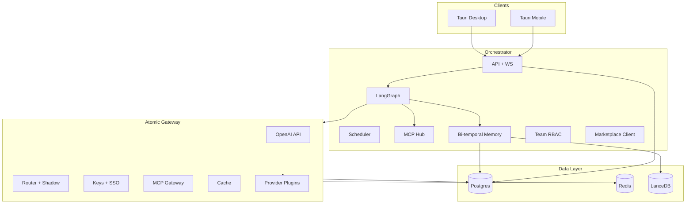

# Atomic-Workstation Full Platform - Plan

## Goal Capsule

- **Objective:** Deliver the complete Atomic-Workstation platform end-to-end — desktop and mobile clients, self-hosted Docker and Kubernetes distributions, first-party Atomic Gateway with full provider catalog and enterprise controls, modern workbench, bi-temporal knowledge graph, full connector ecosystem, team RBAC, and all eight marketing reference workflows — with zero deferred product scope.
- **Authority hierarchy:** Product Contract is exhaustive; Planning Contract KTDs resolve architecture; unspecified implementation detail is left to the implementer within stated patterns.
- **Stop conditions:** Surface blockers only for physically impossible constraints (e.g., provider revokes API entirely); do not defer scope — resolve with documented assumptions instead.
- **Execution profile:** Ten delivery phases, ~36 implementation units. Contract-test gateway OpenAI surface first; E2E all eight workflows in CI before release.
- **Tail ownership:** Implementer owns commits, CI, installers, Helm charts, and mobile store submission artifacts.

---

## Product Contract

### Summary

Atomic-Workstation is a local-first, self-hostable AI workstation for builders who operate entire workflows across code, terminals, browsers, email, databases, chat, and deployment tools in one environment. The complete platform includes: Tauri desktop + Tauri mobile apps, orchestrator sidecar, **Atomic Gateway** (first-party OpenAI-compatible AI/MCP gateway), bi-temporal project knowledge graph, reusable agent workflows with scheduling, team/org RBAC with OIDC/SAML SSO, plugin marketplace, and connectors for GitHub, Vercel, Gmail, Supabase, Slack, and generic webhooks.

**Scope policy:** This plan has no "deferred for later" product features. Every capability listed in requirements ships in this program.

### Problem Frame

Builders lose flow switching between editors, terminals, browsers, dashboards, email, and scattered AI tabs. AI helps inside one surface while the workflow stays fragmented. Atomic-Workstation unifies work orchestration: system-wide context, persistent memory, native gateway, and agents that execute real cross-tool workflows locally with your keys.

### Requirements

**Platform & distribution**

- R1. Desktop app: macOS, Windows, Linux native installers via CI.
- R2. Mobile companion apps: iOS and Android via Tauri 2 mobile (project switch, agent chat, workflow triggers, approvals, notifications).
- R3. Self-host Docker Compose: orchestrator, gateway, Postgres, Redis, Ollama (optional).
- R4. Self-host Kubernetes: Helm chart with HA gateway, orchestrator, ingress, persistent volumes.
- R5. BYOK for all cloud providers; Ollama/vLLM for local inference; no training on user data.
- R6. All state in user-configurable data directory or mounted volumes.

**Atomic Gateway — API surface**

- R7. OpenAI-compatible: `/v1/chat/completions`, `/v1/completions`, `/v1/embeddings`, `/v1/images/generations`, `/v1/audio/transcriptions`, `/v1/audio/speech`, `/v1/models`, SSE streaming.
- R8. Drop-in for OpenAI SDK clients via `baseURL` only.
- R9. `gateway.yaml` + runtime CRUD API; hot reload without restart.
- R10. Master key + virtual key Bearer auth; JWT for service accounts.
- R11. Pass-through endpoints for provider-native APIs.
- R12. Health, readiness, per-provider status.

**Atomic Gateway — providers (full catalog)**

- R13. Plugin `ProviderAdapter` interface: chat, embed, stream, image, audio, token count, cost estimate.
- R14. Ship adapters for all major providers in one release:

| Family | Providers |
| --- | --- |
| US labs | OpenAI, Anthropic, xAI, Perplexity, Cohere, AI21 |
| Google | Gemini API, Vertex AI |
| Microsoft | Azure OpenAI, Azure AI Inference |
| Amazon | Bedrock, SageMaker endpoints |
| Open aggregators | OpenRouter, Together, Fireworks, Anyscale, DeepSeek, Groq, Mistral |
| Local/self-host | Ollama, vLLM, LM Studio, llama.cpp server, LocalAI |
| Cloud ML | Replicate, HuggingFace Inference, Baseten, Modal |
| Enterprise | Snowflake Cortex, Databricks Foundation Models, Nvidia NIM |
| Other | Cloudflare Workers AI, GitHub Models, Aleph Alpha, Watsonx (IBM) |

- R15. Adapter marketplace: signed plugin bundles installable from workbench; community adapter submission flow with schema validation.
- R16. Model registry: alias → multiple deployments; tags for capability (vision, tools, json-mode).

**Atomic Gateway — routing & reliability**

- R17. Retries, fallback chains, budget-fallbacks, cooldowns, usage-based load balancing.
- R18. Context-window pre-check; content-policy fallbacks.
- R19. A/B traffic mirroring: shadow deployments receive duplicate requests; primary latency unaffected; shadow responses logged for comparison.
- R20. Prompt caching passthrough for providers that support it.

**Atomic Gateway — auth, teams, enterprise**

- R21. Virtual keys: model allowlists, budgets, RPM/TPM, metadata tags, expiry, rotation.
- R22. Organizations → teams → users hierarchy with role-based permissions.
- R23. OIDC and SAML SSO for gateway admin and workstation login.
- R24. SCIM user provisioning hooks for enterprise self-host.
- R25. Audit log: immutable append-only record of admin actions, key usage, config changes.

**Atomic Gateway — spend & observability**

- R26. Per-request logging: tokens, cost, latency, key, team, project tag, cache hit, shadow flag.
- R27. Spend dashboards and export API; budget alert webhooks to Slack/email.
- R28. OpenTelemetry traces, Prometheus metrics, Langfuse/LangSmith-compatible export.
- R29. Secret manager backends: env, OS keychain, HashiCorp Vault, AWS Secrets Manager.

**Atomic Gateway — MCP**

- R30. MCP Gateway: stdio, Streamable HTTP, SSE transports.
- R31. Per-key/team MCP server and tool ACL.
- R32. REST `/mcp/tools/list`, `/mcp/tools/call`; OpenAPI spec import → MCP tools.
- R33. OAuth PKCE for MCP servers; static header and server variable support.

**Atomic Gateway — cache, guardrails, policies**

- R34. Exact-match and semantic response cache; Redis backend in production.
- R35. Guardrail plugin pipeline: PII redact, blocklist, regex, custom WASM/JS plugins.
- R36. Per-key/team/model default guardrails; policy bundles.

**Atomic Gateway — admin**

- R37. Admin UI: keys, teams, models, deployments, fallbacks, shadow routes, MCP, guardrails, spend, logs, audit.
- R38. Embedded in workbench settings and available standalone at `:4000/admin`.

**Modern workbench (desktop)**

- R39. Dockable panels: editor, terminal, browser, agent, database, email, connectors, gateway, marketplace.
- R40. Command palette, shortcuts, layout presets, status bar with agent/gateway/sync state.
- R41. NeuroRainbow Cyberpunk design system across desktop, mobile, admin UI.

**Workspace & projects**

- R42. Multi-workspace, multi-project; scripts registry per workspace.
- R43. Instant context switch preserving terminal, browser, editor, agent state (<2s).
- R44. Project dashboard: git, deploys, memory, spend, scheduled workflows.

**Work surfaces**

- R45. Monaco editor: multi-tab, tree, diff, inline assist.
- R46. PTY terminals: multi-tab, persistent per project.
- R47. Playwright browser: multi-tab, screenshots, competitive compare mode.
- R48. Database panel: Supabase/Postgres/SQLite; SQL + NL query; charts.
- R49. Email panel: inbox preview, draft review, approval-gated send.

**Agents & workflows**

- R50. LangGraph runtime: tools, streaming, approval gates, checkpoints.
- R51. Workflow library: save, version, fork, parameterize, share via marketplace.
- R52. Scheduled/cron workflows and event triggers (git push, deploy fail, new email).
- R53. Destructive actions require approval; audit trail per run.

**Memory (bi-temporal knowledge graph)**

- R54. Bi-temporal graph: valid-time + transaction-time on facts and edges.
- R55. Hybrid retrieval: vector (LanceDB) + BM25 + graph traversal + tag filter.
- R56. Auto-ingest: repo files, git, connectors, workflow logs, gateway usage patterns.
- R57. Memory consolidation job: dedupe, decay stale facts, promote high-confidence edges.
- R58. Contradiction detection: `contradicts` edges with confidence decay.

**AI-native dev**

- R59. Inline explain/fix/refactor/test with full environment context.
- R60. Debug mode: terminal + browser console + stack trace → linked diffs.
- R61. All inference via Atomic Gateway.

**Connectors**

- R62. GitHub, R63. Vercel, R64. Gmail, R65. Supabase, R66. Slack.
- R67. Generic webhook ingress/egress for custom CI and deploy flows.
- R68. Credentials in vault; OAuth loopback; connector health in dashboard.

**Team & collaboration**

- R69. Multi-user workspaces with roles: owner, admin, builder, viewer.
- R70. Shared projects, shared workflow templates, shared connector configs (scoped).
- R71. Activity feed and run history visible to team members with permission.

**Reference workflows (all eight — complete acceptance bar)**

- R72. Bug report email → find code → fix → verify dev server → deploy → draft reply.
- R73. Analytics from plain English → query → chart → 30-day comparison follow-up.
- R74. Competitive site audit → dual screenshots → UX/copy/feature report.
- R75. Dev standup prep → git + Vercel + Gmail synthesis.
- R76. Weekly metrics digest → query metrics → HTML report with charts → draft email with attachment.
- R77. Failed deployment fix → Vercel logs → patch → verify → redeploy.
- R78. Update hero → edit → dev preview → deploy → confirm live URL.
- R79. Release changelog → git since tag → changelog → draft Slack/Gmail to team.

**Marketplace & extensibility**

- R80. In-app marketplace for workflow templates, gateway adapter plugins, guardrail plugins, MCP server packs.
- R81. Signed packages; local install; offline mode uses cached packages only.

**Mobile**

- R82. iOS/Android: auth, project list, agent chat, workflow run, push approval requests, spend summary.
- R83. Biometric unlock for vault access on mobile.

### Actors

- A1. Builder
- A2. Agent runtime
- A3. MCP servers (local + gateway)
- A4. Orchestrator
- A5. Atomic Gateway
- A6. Team admin
- A7. Mobile user (builder on phone)

### Key Flows

- F1. Project switch — R42, R43
- F2. Workflow execution — R50–R53
- F3. Memory ingest + consolidate — R54–R58
- F4. Gateway request pipeline — R7–R36
- F5. Team invite + SSO login — R22, R23, R69
- F6. Scheduled weekly metrics — R52, R76
- F7. Shadow deployment comparison — R19
- F8. Mobile approval — R82, R53

### Acceptance Examples

- AE1. Bug report email to deployed fix (R72).
- AE2. Analytics query + 30-day follow-up (R73).
- AE3. Competitive site audit report (R74).
- AE4. Dev standup prep (R75).
- AE5. Weekly metrics HTML email digest (R76).
- AE6. Failed deployment fix (R77).
- AE7. Hero update and verify live (R78).
- AE8. Release changelog to team (R79).
- AE9. Gateway provider fallback on 429 (R17).
- AE10. Budget fallback to cheaper model (R21).
- AE11. Shadow deployment logs comparison without affecting primary latency (R19).
- AE12. SSO login via OIDC completes; user lands in shared team workspace (R23, R69).
- AE13. Mobile push approval unblocks deploy step (R82, F8).
- AE14. Bi-temporal memory answers "what did deploy target before last week?" (R54).

### Success Criteria

- AE1–AE14 pass in CI (mock external services where needed; real providers in staging).
- OpenAI Python/JS SDK works against gateway unchanged except `baseURL`.
- Every provider family in R14 has at least one adapter passing contract tests.
- Desktop + mobile + Docker + Helm all install from documented paths.
- Multi-user team with SSO operates shared project and workflow.
- No third-party AI gateway dependency; no credentials in logs.

### Scope Boundaries

**In scope:** Everything in Requirements R1–R83.

**Outside this product's identity (explicit non-goals only)**

- Vendor-hosted multi-tenant SaaS where Atomic holds user API keys centrally.
- Training or fine-tuning models on user data.
- Replacing full IDE feature parity (debugger breakpoints, extension marketplace like VS Code).

There is no deferred product scope in this plan.

---

## Planning Contract

### Assumptions

- Postgres is the production datastore for gateway and orchestrator in self-host; SQLite acceptable for single-user offline desktop mode with sync option.
- Mobile uses Tauri 2 mobile for maximum code reuse with desktop.
- Provider adapters ship in waves within the program but all R14 families complete before GA — no family left unimplemented.

### Key Technical Decisions

- **KTD1.** Tauri 2 desktop + mobile; Rust for shell, keychain, sidecars.
- **KTD2.** TypeScript orchestrator (Fastify + WS).
- **KTD3.** Atomic Gateway as first-party `apps/gateway` — no LiteLLM or third-party gateway (session-settled: user-directed).
- **KTD4.** Provider plugins in `packages/gateway-providers/*` + marketplace signed bundles.
- **KTD5.** Dual MCP: local `mcp-hub` (workstation) + gateway MCP (external).
- **KTD6.** LangGraph workflows + cron scheduler in orchestrator.
- **KTD7.** Bi-temporal graph in Postgres + LanceDB vectors (not lightweight SQLite-only graph).
- **KTD8.** Redis for cache, rate limits, shadow request queue in production.
- **KTD9.** OIDC/SAML via `openid-client` + SAML library; SCIM REST endpoints.
- **KTD10.** Helm chart for K8s; Compose for single-node.

### High-Level Technical Design

### Phased Delivery

| Phase | Focus | Units |
| --- | --- | --- |
| P0 | Monorepo, orchestrator, projects | U1–U3 |
| P1 | Gateway core + router | U13, U17 |
| P2 | Provider catalog wave 1 (US labs + local) | U15 |
| P3 | Provider catalog wave 2 (cloud + enterprise) | U23 |
| P4 | Gateway enterprise (keys, SSO, audit, shadow) | U18, U24, U25, U26 |
| P5 | MCP gateway, cache, guardrails, admin | U19, U22, U20 |
| P6 | Workbench + surfaces | U4, U14, U8, U21 |
| P7 | Memory graph + AI dev | U9, U16 |
| P8 | Connectors + team RBAC | U10, U27 |
| P9 | Workflows + scheduler + all 8 AEs | U7, U12, U28 |
| P10 | Mobile, marketplace, K8s, ship | U29, U30, U11, U31 |

---

## Implementation Units

| U-ID | Title | Depends on |
| --- | --- | --- |
| U1 | Monorepo and Tauri desktop scaffold | — |
| U2 | Orchestrator sidecar and API | U1 |
| U3 | Workspace, project, and scripts registry | U2 |
| U4 | Editor and terminal panels | U3, U14 |
| U5 | Local MCP hub and credential vault | U2 |
| U6 | Agent runtime via Atomic Gateway | U5, U13, U19 |
| U7 | Workflow engine, library, and scheduler | U6 |
| U8 | Browser panel and Playwright MCP | U5 |
| U9 | Bi-temporal knowledge graph and memory | U3 |
| U10 | Full connector ecosystem | U5, U9, U19 |
| U11 | Docker Compose self-host | U2, U13 |
| U12 | All eight reference workflows | U7, U8, U10, U21, U28 |
| U13 | Atomic Gateway core proxy | U2 |
| U14 | Modern workbench shell UI | U3 |
| U15 | Provider adapters wave 1 | U13 |
| U16 | AI-native dev and debug assist | U4, U6, U9 |
| U17 | Router, fallbacks, shadow mirroring | U13, U15 |
| U18 | Virtual keys, budgets, spend, alerts | U13 |
| U19 | MCP Gateway | U13 |
| U20 | Gateway admin UI | U13, U18, U25 |
| U21 | Database and email panels | U10 |
| U22 | Cache, guardrails, observability | U13 |
| U23 | Provider adapters wave 2 (full R14 catalog) | U15 |
| U24 | A/B shadow traffic mirroring | U17 |
| U25 | OIDC, SAML SSO, SCIM, audit log | U13, U18 |
| U26 | Team/org RBAC across platform | U3, U18, U25 |
| U27 | Generic webhook connector | U10 |
| U28 | Cron and event workflow triggers | U7 |
| U29 | Plugin and template marketplace | U7, U15, U22 |
| U30 | Tauri mobile apps | U3, U6, U14 |
| U31 | Kubernetes Helm chart and HA deploy | U11 |

### U1. Monorepo and Tauri desktop scaffold

- **Goal:** pnpm monorepo; Tauri 2 desktop opens workbench shell.
- **Requirements:** R1, R6, R41
- **Files:** `package.json`, `pnpm-workspace.yaml`, `apps/desktop/`, `packages/shared/`, `packages/ui/`
- **Approach:** Tauri 2 + React + Vite. Design tokens in `packages/ui`. Sidecar slots for orchestrator and gateway. CI builds Linux artifact.
- **Test scenarios:** `pnpm -r build` passes; app launches headless in CI.
- **Verification:** Desktop CI build green.

### U2. Orchestrator sidecar and API

- **Goal:** Fastify + WebSocket API; Postgres/SQLite data layer abstraction.
- **Requirements:** R6
- **Files:** `apps/orchestrator/src/server.ts`, `packages/shared/src/api-types.ts`
- **Approach:** Health, graceful shutdown, data dir bootstrap. Tauri spawns on start.
- **Test scenarios:** `/health` 200; WS connects; crash restart within 10s.
- **Verification:** Integration test spawns orchestrator.

### U3. Workspace, project, and scripts registry

- **Goal:** CRUD workspaces/projects; script definitions; state persistence.
- **Requirements:** R42, R43, R44
- **Files:** `apps/orchestrator/src/projects/`, `apps/desktop/src/features/projects/`
- **Approach:** Postgres schema; panel state JSON per project; scripts as named shell/npm commands in workspace manifest.
- **Test scenarios:** Two projects switch without state loss; dashboard shows git branch.
- **Verification:** API tests + Playwright switch smoke.

### U13. Atomic Gateway core proxy

- **Goal:** Full OpenAI-compatible API surface including images and audio.
- **Requirements:** R7–R12
- **Files:** `apps/gateway/`, `packages/gateway-core/`
- **Approach:** Fastify on `:4000`; all R7 endpoints; hot reload config; pass-through mode for native provider paths.
- **Test scenarios:** OpenAI SDK chat + embed + image; 401 without key.
- **Verification:** Contract test suite.

### U15. Provider adapters wave 1

- **Goal:** US labs + local inference adapters.
- **Requirements:** R13, R14 (partial)
- **Files:** `packages/gateway-providers/openai`, `anthropic`, `xai`, `perplexity`, `cohere`, `ai21`, `ollama`, `vllm`, `lmstudio`, `groq`, `mistral`, `together`, `deepseek`, `openrouter`, `fireworks`
- **Approach:** `ProviderAdapter` interface; fixture tests per adapter; cost estimation tables.
- **Test scenarios:** Each adapter passes nock fixtures; streaming works.
- **Verification:** `pnpm --filter gateway-providers test`.

### U23. Provider adapters wave 2

- **Goal:** Complete R14 catalog — cloud ML, enterprise, remaining providers.
- **Requirements:** R14, R15
- **Files:** `packages/gateway-providers/google`, `vertex`, `azure-openai`, `bedrock`, `sagemaker`, `replicate`, `huggingface`, `baseten`, `modal`, `snowflake`, `databricks`, `nvidia-nim`, `cloudflare`, `github-models`, `aleph-alpha`, `watsonx`, `packages/gateway-marketplace/`
- **Approach:** Finish all families; marketplace packaging format for third-party adapters; signing with ed25519.
- **Test scenarios:** Contract test per family; marketplace bundle install loads new adapter.
- **Verification:** Full provider matrix CI job.

### U17. Router, fallbacks, and shadow mirroring

- **Goal:** Production routing with reliability and A/B shadow support.
- **Requirements:** R17, R18, R19, R20
- **Files:** `apps/gateway/src/router/`
- **Dependencies:** U13, U15
- **Approach:** Fallback chains, budget-fallbacks, cooldowns, LB. Shadow: async duplicate to shadow deployment; log diff metadata. Prompt cache headers forwarded.
- **Test scenarios:** Covers AE9, AE11; context pre-check rejects overflow.
- **Verification:** Router integration tests.

### U24. A/B shadow traffic mirroring

- **Goal:** Shadow route configuration and comparison UI.
- **Requirements:** R19
- **Files:** `apps/gateway/src/shadow/`, admin UI shadow page
- **Dependencies:** U17
- **Approach:** Config `shadow_routes: { primary: gpt-4o, shadow: gpt-4o-mini, sample_rate: 0.1 }`. Queue shadow calls in Redis; never block primary response.
- **Test scenarios:** Covers AE11: primary p99 unchanged with shadow enabled.
- **Verification:** Load test comparing latency with/without shadow.

### U18. Virtual keys, budgets, spend, alerts

- **Goal:** Full cost control and accounting.
- **Requirements:** R21, R26, R27, R28, R29
- **Files:** `apps/gateway/src/auth/`, `apps/gateway/src/spend/`
- **Approach:** Virtual keys in Postgres; budget-fallback; webhooks to Slack/email on threshold; secret manager plugin interface.
- **Test scenarios:** Covers AE10; budget alert webhook fires.
- **Verification:** Auth + spend integration tests.

### U25. OIDC, SAML SSO, SCIM, audit log

- **Goal:** Enterprise identity and compliance.
- **Requirements:** R23, R24, R25
- **Files:** `apps/gateway/src/sso/`, `apps/orchestrator/src/sso/`, `apps/gateway/src/audit/`
- **Approach:** Shared SSO session for gateway admin + workbench. SCIM `/Users` `/Groups`. Append-only audit table.
- **Test scenarios:** Covers AE12 with Keycloak fixture in CI.
- **Verification:** SSO e2e with test IdP container.

### U26. Team/org RBAC across platform

- **Goal:** Multi-user collaboration with permissions.
- **Requirements:** R22, R69, R70, R71
- **Files:** `apps/orchestrator/src/teams/`, `apps/gateway/src/teams/`
- **Dependencies:** U3, U18, U25
- **Approach:** Roles enforced on projects, workflows, connectors, keys. Activity feed from audit + run logs.
- **Test scenarios:** Viewer cannot deploy; admin can rotate keys.
- **Verification:** RBAC matrix tests.

### U19. MCP Gateway

- **Goal:** Full MCP server management and tool exposure.
- **Requirements:** R30–R33
- **Files:** `apps/gateway/src/mcp/`
- **Approach:** All transports; OpenAPI→MCP generator; OAuth PKCE; per-team ACL.
- **Test scenarios:** GitHub MCP tools callable via REST; OAuth MCP connects.
- **Verification:** MCP integration tests.

### U22. Cache, guardrails, observability

- **Goal:** Production safety and monitoring.
- **Requirements:** R34–R36, R28
- **Files:** `apps/gateway/src/cache/`, `guardrails/`, `observability/`
- **Approach:** Redis semantic cache; WASM guardrail plugins; OTEL + Prometheus.
- **Test scenarios:** Cache hit logged; PII guardrail blocks; metrics scrape works.
- **Verification:** Unit + scrape tests.

### U20. Gateway admin UI

- **Goal:** Complete admin dashboard.
- **Requirements:** R37, R38
- **Files:** `apps/gateway/src/admin-ui/`
- **Approach:** All admin surfaces including shadow routes, SSO config, team management, marketplace uploads.
- **Test scenarios:** Full config cycle without YAML edit.
- **Verification:** Playwright admin suite.

### U14. Modern workbench shell UI

- **Goal:** Unified dockable environment.
- **Requirements:** R39–R41
- **Files:** `apps/desktop/src/workbench/`
- **Approach:** All panels dockable; command palette; presets; cyberpunk theme.
- **Test scenarios:** Layout persists; palette switches project.
- **Verification:** Visual regression smoke.

### U4. Editor and terminal panels

- **Goal:** Code editing and PTY terminals.
- **Requirements:** R45, R46
- **Files:** `apps/desktop/src/panels/editor/`, `terminal/`
- **Approach:** Monaco + node-pty over WS.
- **Test scenarios:** Save round-trip; PTY echo; multi-tab persist on switch.
- **Verification:** API + smoke tests.

### U5. Local MCP hub and vault

- **Goal:** Workstation-native tools and secrets.
- **Requirements:** R68
- **Files:** `packages/mcp-hub/`, vault module
- **Approach:** Filesystem, git, shell MCP servers; OS keychain + encrypted Postgres fallback.
- **Test scenarios:** Secret never in logs; MCP restart recovery.
- **Verification:** Vault round-trip tests.

### U6. Agent runtime

- **Goal:** LangGraph agent via gateway only.
- **Requirements:** R50, R53, R61
- **Files:** `apps/orchestrator/src/agent/`
- **Approach:** Merge local + gateway MCP tools; approval gates; gateway virtual key per project.
- **Test scenarios:** Tool loop completes; approval blocks deploy.
- **Verification:** Agent integration tests.

### U7. Workflow engine, library, and scheduler

- **Goal:** Reusable workflows with cron and events.
- **Requirements:** R51, R52
- **Files:** `packages/workflows/`, `apps/orchestrator/src/scheduler/`
- **Approach:** Template store; cron via `node-cron`; event bus for deploy-fail, new-email hooks.
- **Test scenarios:** Cron fires workflow; event trigger on mock webhook.
- **Verification:** Scheduler integration tests.

### U28. Cron and event workflow triggers

- **Goal:** Scheduled weekly metrics and event-driven runs.
- **Requirements:** R52, R76
- **Files:** `apps/orchestrator/src/scheduler/triggers.ts`
- **Dependencies:** U7
- **Approach:** Weekly metrics workflow registered as default cron Sunday 6am user TZ.
- **Test scenarios:** Covers AE5 schedule fires in accelerated test clock.
- **Verification:** Time-mocked scheduler test.

### U8. Browser panel

- **Goal:** Playwright browser for agents and audits.
- **Requirements:** R47
- **Files:** `apps/desktop/src/panels/browser/`
- **Test scenarios:** Screenshot; dual-tab competitive compare.
- **Verification:** Browser MCP integration test.

### U9. Bi-temporal knowledge graph

- **Goal:** Full memory subsystem with time travel.
- **Requirements:** R54–R58
- **Files:** `packages/memory/`
- **Approach:** Postgres graph tables with `valid_from`, `valid_to`, `recorded_at`. LanceDB embeddings. Consolidation cron. Contradiction edges.
- **Test scenarios:** Covers AE14; ingest + query "deploy target last Tuesday".
- **Verification:** Graph traversal unit tests.

### U10. Full connector ecosystem

- **Goal:** GitHub, Vercel, Gmail, Supabase, Slack.
- **Requirements:** R62–R66
- **Files:** `packages/mcp-hub/servers/`, `apps/orchestrator/src/connectors/`
- **Test scenarios:** Each connector contract tests; OAuth flows documented.
- **Verification:** MSW fixture suite.

### U27. Generic webhook connector

- **Goal:** Custom CI/deploy integrations.
- **Requirements:** R67
- **Files:** `apps/orchestrator/src/connectors/webhook/`
- **Approach:** Inbound signed webhooks trigger workflows; outbound POST on workflow steps.
- **Test scenarios:** Inbound webhook starts deploy-fix workflow.
- **Verification:** Webhook signature tests.

### U21. Database and email panels

- **Goal:** Query UI and email preview.
- **Requirements:** R48, R49
- **Files:** `apps/desktop/src/panels/database/`, `email/`
- **Test scenarios:** Chart renders; email draft approval UI.
- **Verification:** Component tests.

### U16. AI-native dev and debug assist

- **Goal:** Full-context inline assist.
- **Requirements:** R59, R60
- **Files:** `apps/desktop/src/panels/editor/InlineAssist.tsx`, `DebugAssist.tsx`
- **Test scenarios:** Debug proposes fix from stack trace fixture.
- **Verification:** Context builder tests.

### U12. All eight reference workflows

- **Goal:** AE1–AE8 complete in CI.
- **Requirements:** R72–R79
- **Files:** `packages/workflows/src/templates/*`, `examples/sample-next-app/`
- **Dependencies:** U7, U8, U10, U21, U28
- **Test scenarios:**
  - AE1: email → fix → deploy → draft reply
  - AE2: NL query → chart → 30-day compare
  - AE3: competitive audit markdown + screenshots
  - AE4: standup synthesis
  - AE5: weekly HTML metrics email draft
  - AE6: failed deploy fix
  - AE7: hero update live
  - AE8: changelog + team message
- **Verification:** `pnpm --filter desktop test:e2e --workflows=all`

### U29. Plugin and template marketplace

- **Goal:** In-app distribution for adapters, workflows, guardrails.
- **Requirements:** R80, R81, R15
- **Files:** `apps/marketplace/`, `apps/desktop/src/features/marketplace/`
- **Approach:** Local registry + optional remote catalog URL; ed25519 signed packages; offline uses cache.
- **Test scenarios:** Install workflow template; appears in library.
- **Verification:** Marketplace install e2e.

### U30. Tauri mobile apps

- **Goal:** iOS and Android companion.
- **Requirements:** R82, R83
- **Files:** `apps/mobile/`
- **Approach:** Tauri 2 mobile; shared `@atomic/ui`; push notifications for approvals; biometric vault unlock.
- **Test scenarios:** Covers AE13: push approval resumes workflow.
- **Verification:** Mobile simulator CI + manual device checklist.

### U11. Docker Compose self-host

- **Goal:** Single-command full stack.
- **Requirements:** R3
- **Files:** `deploy/docker-compose.yml`, Dockerfiles
- **Approach:** Services: postgres, redis, gateway, orchestrator, ollama (profile). Volumes for data. `.env.example`.
- **Test scenarios:** `docker compose up --wait` healthy; AE9 via curl.
- **Verification:** Compose CI job.

### U31. Kubernetes Helm chart

- **Goal:** Production HA deployment.
- **Requirements:** R4
- **Files:** `deploy/helm/atomic-workstation/`
- **Approach:** Helm chart with gateway HPA, ingress, secrets, Postgres/Redis subcharts optional.
- **Test scenarios:** `helm install` on kind cluster; pods ready.
- **Verification:** Helm lint + kind integration in CI.

---

## Verification Contract

| Gate | Command | When |
| --- | --- | --- |
| Unit tests | `pnpm -r test` | Every commit |
| Gateway contracts | `pnpm --filter gateway test:contract` | PR |
| All providers | `pnpm --filter gateway-providers test:matrix` | PR |
| Gateway integration | `pnpm --filter gateway test:integration` | PR |
| Orchestrator integration | `pnpm --filter orchestrator test:integration` | PR |
| SSO e2e | `pnpm --filter gateway test:sso` | PR |
| Workflow e2e | `pnpm --filter desktop test:e2e --workflows=all` | PR |
| Mobile smoke | `pnpm --filter mobile test:smoke` | PR |
| Docker Compose | `docker compose up --wait` | PR |
| Helm kind | `helm test atomic-workstation` | PR nightly |
| Security | secret scan + RBAC audit + no creds in logs | PR |

---

## Definition of Done

**Global — nothing deferred**

- R1–R83 implemented and traced to units.
- AE1–AE14 pass (CI or documented staging for provider-specific cases).
- All R14 provider families have shipping adapters.
- Desktop, mobile, Docker, Helm install paths documented and CI-verified.
- Atomic Gateway: full API, all providers, SSO, teams, shadow, MCP, cache, guardrails, admin, marketplace.
- Eight reference workflows runnable end-to-end.
- Bi-temporal memory operational.
- Team RBAC + SSO operational.
- No LiteLLM or third-party gateway code.
- GA release artifacts published.

**Per-phase exit**

| Phase | Exit criterion |
| --- | --- |
| P0–P1 | Gateway accepts OpenAI SDK chat |
| P2–P3 | Full R14 provider matrix green |
| P4 | AE9, AE10, AE11, AE12 pass |
| P5 | Admin UI complete; MCP gateway live |
| P6–P7 | Workbench + memory + dev assist live |
| P8 | All connectors + team RBAC |
| P9 | AE1–AE8 e2e green |
| P10 | Mobile AE13; Helm deploy; marketplace install |

---

## Appendix

### Provider adapter checklist (all in scope)

Every row requires a shipping adapter package with contract tests before GA:

OpenAI, Anthropic, xAI, Perplexity, Cohere, AI21, Google Gemini, Vertex AI, Azure OpenAI, Azure AI Inference, AWS Bedrock, SageMaker, OpenRouter, Together, Fireworks, Anyscale, DeepSeek, Groq, Mistral, Ollama, vLLM, LM Studio, LocalAI, Replicate, HuggingFace Inference, Baseten, Modal, Snowflake Cortex, Databricks FM, Nvidia NIM, Cloudflare Workers AI, GitHub Models, Aleph Alpha, Watsonx.

### Eight workflows traceability

| Workflow | Req | Template file |
| --- | --- | --- |
| Bug email → fix | R72 | `bug-email-to-fix.ts` |
| Analytics NL query | R73 | `analytics-query.ts` |
| Competitive audit | R74 | `competitive-audit.ts` |
| Standup prep | R75 | `standup-prep.ts` |
| Weekly metrics digest | R76 | `weekly-metrics-digest.ts` |
| Failed deploy fix | R77 | `fix-deployment.ts` |
| Hero update live | R78 | `update-hero.ts` |
| Release changelog | R79 | `release-changelog.ts` |

### Outside identity (unchanged non-goals)

Hosted multi-tenant SaaS, user-data model training, full VS Code parity — these are not product goals, not deferred features.
